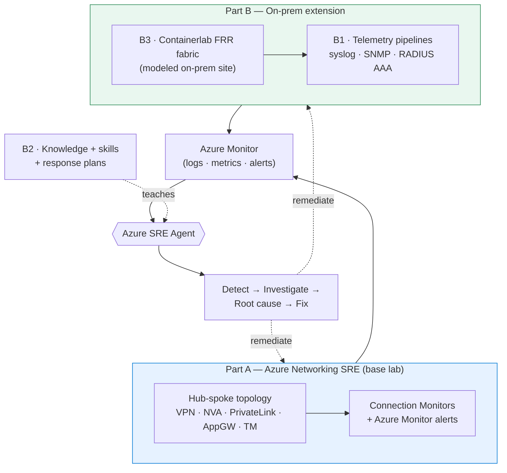

# Azure Networking SRE Agent — Test Environment

## Why this repo

The [Azure SRE Agent](https://sre.azure.com) can detect, investigate, and help
remediate incidents — but to trust it with **networking**, you need a realistic
environment that (a) breaks in realistic ways and (b) emits the telemetry a real
operator would use to diagnose it. This repo is that environment: a **deploy-it-
yourself lab** plus everything the agent needs to reason about it.

It exists to answer two questions end-to-end:

1. **Can an SRE Agent handle Azure networking incidents?** — a multi-hub hub-spoke
   topology, a catalogue of injectable faults, and the knowledge/skills that let the
   agent go from *alert* → *investigation* → *root cause* → *fix*.
2. **Can we extend that story to on-premises networking?** — where devices speak
   legacy protocols, telemetry arrives over syslog/SNMP/RADIUS, and the agent has no
   built-in knowledge of your fabric. We model a real on-prem router fabric, stream
   its telemetry into Azure Monitor, and teach the agent to triage it.

## What it is

- **Bicep infrastructure-as-code** for the full topology (hub/spoke networking, VPN,
  NVA, Private Link, AppGW, Traffic Manager) **plus** an optional on-prem extension
  (telemetry collector, RADIUS AAA, and a Containerlab FRR fabric).
- **Knowledge base** (17 files) that teaches the SRE Agent about Azure *and* on-prem
  networking, plus **custom sub-agents, skills, and incident response plans**.
- **Fault-injection scripts** — 33 scenarios across 7 categories, including
  control-plane faults inside the on-prem Containerlab fabric.
- **Connection Monitors & alerts** — 11 test groups that trigger the agent
  automatically — and a **health-check script** (20 sections) for verification.

## How to use it

1. **Deploy** the lab (`scripts/deploy.ps1`) — see [Quick Start](#quick-start).
2. **Configure the agent** (`scripts/configure-sre-agent.ps1 -Apply`) — uploads
   knowledge, applies sub-agents + response plans.
3. **Inject a fault** (`scripts/inject-fault.ps1`) and watch the agent detect,
   investigate, and (in Autonomous mode) remediate it.
4. **Verify / tear down** with `scripts/check-health.ps1` and `scripts/teardown.ps1`.

---

## 🗺️ How this project is organized

The repo is one lab told in **two parts**. Start with the part you care about.



### Part A — Azure Networking SRE *(the base story)*

The hub-spoke Azure lab and the SRE Agent that watches it. Everything you need to
deploy the topology, break it, and let the agent fix it lives in **this README**
(Architecture, Quick Start, Fault Injection, Connection Monitors, Health Check) plus:

- **[SRE Agent configuration — how it works](docs/sre-agent-configuration.md)** — the
  two config planes (ARM + data plane), the detection model, and how
  `configure-sre-agent.ps1 -Apply` turns a bare agent resource into a *working* one.

### Part B — Extension to on-premises networking

On-prem is different: legacy telemetry protocols and no built-in agent knowledge of
your fabric. This part is covered by three concerns (read the
[**docs hub**](docs/README.md) for the guided reading order):

| # | Concern | Answers | Deep dive |
|---|---------|---------|-----------|
| **B1** | **On-prem telemetry → Azure** | How do syslog, SNMP metrics, and RADIUS AAA reach Azure Monitor? | [telemetry pipelines](docs/onprem-telemetry-pipelines-how-it-works.md) |
| **B2** | **Agent knowledge, skills & closing the loop** | What must the agent *know* to triage on-prem faults, and how does it detect, reason, and act? | [SRE Agent telemetry & actuation](docs/sre-agent-telemetry-and-actuation.md), [`knowledge/`](knowledge/), [`sre-agent-config/skills/onprem-fabric-triage`](sre-agent-config/skills/onprem-fabric-triage) |
| **B3** | **Modeling on-prem with Containerlab** | How does the lab simulate a real multi-router on-prem site (and inject control-plane faults)? | [Containerlab fabric](docs/containerlab-onprem-how-it-works.md) |

> **Design rationale underpinning all of Part B:** [On-prem simulation &
> telemetry — design & decisions](docs/onprem-network-simulation-and-telemetry.md)
> explains *why* we simulate devices this way, the options considered, and the
> data-plane-vs-control-plane detection strategy.
>
> **Build order note:** although B1 (telemetry) is the *goal* that motivated the
> extension, when deploying you provision in dependency order — **model the devices
> (B3) → stream their telemetry (B1) → teach the agent (B2)**.

---

## Architecture

```
                            ┌────────────────────────────────────┐
                            │          On-Prem VNet              │
                            │          10.100.0.0/16             │
                            │     VPN GW (BGP, ASN 65100)        │
                            │     Test VM (workload)             │
                            └───────────────┬────────────────────┘
                          S2S VPN (BGP)     │     S2S VPN (BGP)
                    ┌───────────────────────┴──────────────────────────┐
           ┌────────┴─────────────────────┐          ┌─────────────────┴────────────┐
           │        Hub 1 VNet            │   VNet   │        Hub 2 VNet            │
           │        10.1.0.0/16           │◄─Peering─►        10.2.0.0/16           │
           │                              │          │                              │
           │  NVA (Ubuntu+iptables)       │          │  NVA (Ubuntu+iptables)       │
           │  Internal LB (10.1.1.200)    │          │  Internal LB (10.2.1.200)    │
           │  VPN GW (BGP, ASN 65001)     │          │  VPN GW (BGP, ASN 65002)     │
           │  App Gateway + WAF           │          │  App Gateway + WAF           │
           │  Private Endpoint (10.1.4.4) │          │                              │
           │    └─► Storage Acct Static Web          │                              │
           └──┬──────────────────┬────────┘          └──┬──────────────────┬────────┘
        ┌─────┴─────┐      ┌─────┴─────┐          ┌─────┴─────┐      ┌─────┴─────┐
        │ Spoke 11  │      │ Spoke 12  │          │ Spoke 21  │      │ Spoke 22  │
        │ 10.11.    │      │ 10.12.    │          │ 10.21.    │      │ 10.22.    │
        │ 0.0/16    │      │ 0.0/16    │          │ 0.0/16    │      │ 0.0/16    │
        │ VM+Apache │      │ VM+Apache │          │ VM+Apache │      │ VM+Apache │
        └───────────┘      └───────────┘          └───────────┘      └───────────┘

               ┌────────────────────────────────────────────────────────────┐
               │              Traffic Manager (netsre-webapp)               │
               │          Endpoints: Hub1 AppGW PIP, Hub2 AppGW PIP         │
               └────────────────────────────────────────────────────────────┘
```

### Component Summary

| Component | Details |
|-----------|---------|
| **On-Prem VNet + VPN GW** | Simulates on-premises site with BGP (ASN 65100), connected to both hubs via S2S VPN |
| **Hub 1 / Hub 2** | Transit hubs with Ubuntu NVAs behind Standard Internal LBs; dnsmasq DNS proxy |
| **Spoke VNets (×4)** | Workload VNets peered to their hub, each with Ubuntu VM running Apache |
| **NVA VMs (×2)** | Ubuntu 22.04 with IP forwarding, iptables SNAT, dnsmasq; act as routers + firewalls |
| **VPN Gateways (×3)** | VpnGw1AZ SKU with BGP for dynamic route exchange between hubs and on-prem |
| **Application Gateway** | One per hub; routes external HTTP traffic to spoke VMs through the NVA |
| **Traffic Manager** | Global DNS-based load balancing across AppGW endpoints |
| **Storage Account + Private Endpoint** | Static website accessed via PE (10.1.4.4) in Hub 1; DNS via `privatelink.web.core.windows.net` |
| **Private DNS Zone** | Linked to hub VNets only; spokes resolve via NVA dnsmasq → hub DNS → Private DNS Zone |
| **Connection Monitors** | 11 test groups: spoke-to-spoke, spoke-to-onprem, internet, Traffic Manager, and Static Website PE |
| **Azure Monitor Alerts** | Fire when Connection Monitor checks fail; trigger the SRE Agent |
| **SRE Agent** | Deployed in same RG; autonomous mode with Azure Monitor connector |

### Routing Design

All traffic between spokes, between spokes and on-prem, and to the Private Endpoint traverses the NVA:

- **Spoke → PE**: UDR `10.1.4.0/24 → NVA LB` on spoke subnets overrides the /32 InterfaceEndpoint system route
- **On-prem → PE**: UDR `10.1.4.0/24 → NVA LB` on GatewaySubnet overrides the /32 system route
- **Spoke ↔ Spoke (same hub)**: UDR on spoke WorkloadSubnet → NVA LB
- **Spoke ↔ Spoke (cross-hub)**: NVA in local hub → VNet peering → NVA in remote hub
- **On-prem ↔ Spoke**: onprem VM → VPN GW → GatewaySubnet UDR → NVA LB → spoke
- **On-prem ↔ Application**: onprem VM → Internet → Traffic Manager (DNS) → Application Gateway → spoke


### DNS Design

- Spoke VNets use the local NVA LB as custom DNS server (hub1 spokes → 10.1.1.200, hub2 spokes → 10.2.1.200)
- On-prem VNet uses both NVA LBs as custom DNS servers
- NVAs run dnsmasq, forwarding to Azure DNS (168.63.129.16)
- Private DNS Zone `privatelink.web.core.windows.net` is linked only to hub VNets
- Spokes resolve PE FQDNs via: VM → NVA (dnsmasq) → Azure DNS → Private DNS Zone → PE IP

---

## Prerequisites

| Requirement | Details |
|-------------|---------|
| **Azure subscription** | With permissions to create VNets, VPN Gateways, VMs, LBs, Storage, and Monitor resources |
| **Azure CLI** | v2.50+ — [Install](https://aka.ms/install-azure-cli) |
| **Bicep CLI** | Bundled with Azure CLI ≥ 2.20 |
| **PowerShell** | 7+ (primary scripting language for this project) |
| **Storage Blob Data Contributor** | Required on deploying user for static website upload (`--auth-mode login`) |

---

## Quick Start

```powershell
# 1. Clone the repo
git clone https://github.com/erjosito/networking-sre-agent.git
cd networking-sre-agent

# 2. Log in to Azure
az login

# 3. Deploy (defaults: eastus2, resource group netsre-rg, prefix netsre)
.\scripts\deploy.ps1

# 4. Or customise the deployment
.\scripts\deploy.ps1 -ResourceGroup "mylab-rg" -Location "westus2" -Prefix "mylab"

# 5. Wait ~30-45 minutes (VPN Gateways are the bottleneck)

# 6. Verify connectivity (all 20 sections)
.\scripts\check-health.ps1

# 7. Run specific health check sections
.\scripts\check-health.ps1 -Sections 1,5,20
```

The deployment script automatically:
1. Deploys all Bicep infrastructure
2. Enables the Storage Account static website
3. Uploads `index.html` for HTTP probes
4. Deploys connection monitors to `NetworkWatcherRG`

---

## Fault Injection

Simulate real-world networking failures to exercise the SRE Agent's investigation capabilities. Each scenario includes a `--Revert` mode to cleanly restore the environment.

```powershell
# List all available scenarios
.\scripts\inject-fault.ps1 -Scenario list

# Inject a fault
.\scripts\inject-fault.ps1 -Scenario <name>

# Revert a specific fault
.\scripts\inject-fault.ps1 -Scenario <name> -Revert

# Inject multiple faults simultaneously
.\scripts\inject-fault.ps1 -Scenario multi-fault
```

### Available Scenarios (33 total)

#### IP Forwarding (2 scenarios)

| Scenario | Description | Impact |
|----------|-------------|--------|
| `ip-forwarding-hub1` | Disable NIC-level IP forwarding on Hub1 NVA | All traffic transiting Hub1 NVA is dropped |
| `ip-forwarding-hub2` | Disable NIC-level IP forwarding on Hub2 NVA | All traffic transiting Hub2 NVA is dropped |

#### UDR — User-Defined Routes (3 scenarios)

| Scenario | Description | Impact |
|----------|-------------|--------|
| `udr-wrong-nexthop` | Set incorrect next-hop IP in spoke route table | Traffic goes to non-existent appliance and is black-holed |
| `udr-missing-route` | Remove the default route from spoke route table | Spoke loses path to NVA; traffic uses system routes |
| `udr-detach` | Detach route table from spoke subnet | All custom routing removed; spoke uses default Azure routing |

#### NSG — Network Security Groups (3 scenarios)

| Scenario | Description | Impact |
|----------|-------------|--------|
| `nsg-block-icmp` | Add high-priority NSG rule blocking ICMP | Ping fails but TCP connectivity remains |
| `nsg-block-all` | Add high-priority NSG rule blocking all traffic | Spoke VM becomes completely unreachable |
| `nsg-block-ssh` | Add high-priority NSG rule blocking SSH (port 22) | SSH fails but HTTP and ICMP remain functional |

#### NVA — Network Virtual Appliance (5 scenarios)

| Scenario | Description | Impact |
|----------|-------------|--------|
| `nva-iptables-drop` | Drop all forwarded traffic via iptables on Hub1 NVA | All transit traffic silently dropped |
| `nva-iptables-block-spoke` | Block traffic to/from a specific spoke via iptables | Targeted spoke isolated while others work |
| `nva-os-forwarding` | Disable OS-level IP forwarding (sysctl) on Hub1 NVA | NVA stops routing despite NIC forwarding being enabled |
| `nva-stop-ssh` | Stop the SSH service on Hub1 NVA | Management access lost but forwarding continues |
| `nva-no-internet` | Block outbound internet traffic on NVA via iptables | Spokes lose internet; internal connectivity preserved |

#### VPN / BGP (4 scenarios)

| Scenario | Description | Impact |
|----------|-------------|--------|
| `vpn-disconnect` | Delete VPN connection between Hub1 and on-premises | On-prem loses all connectivity to Hub1 spokes |
| `bgp-propagation` | Enable BGP route propagation on spoke route table | Spoke learns VPN routes directly, bypassing NVA |
| `gw-disable-bgp-propagation` | Disable BGP route propagation on gateway route table | Gateway loses spoke routes; on-prem can't reach spokes |
| `gateway-nsg` | Block VPN gateway traffic with NSG on GatewaySubnet | VPN tunnels drop; all on-prem connectivity lost |

#### Peering (3 scenarios)

| Scenario | Description | Impact |
|----------|-------------|--------|
| `peering-disconnect` | Remove VNet peering between Hub1 and Spoke11 | Spoke11 is fully isolated from hub and all other VNets |
| `peering-no-gateway-transit` | Disable gateway transit on hub-to-spoke peering | Spoke loses VPN routes; can't reach on-prem |
| `peering-no-use-remote-gw` | Disable 'use remote gateway' on spoke-to-hub peering | Spoke stops receiving BGP-learned routes from hub GW |

#### Private Link (4 scenarios)

| Scenario | Description | Impact |
|----------|-------------|--------|
| `pe-nsg-block` | Add NSG deny rule blocking traffic to PE subnet (10.1.4.0/24) | PE unreachable from all sources; HTTP probe fails |
| `pe-dns-break` | Stop dnsmasq on Hub1 NVA | On-prem/spoke DNS resolution of PE FQDN fails |
| `pe-route-missing` | Remove PE subnet UDR from spoke11 route table | Traffic bypasses NVA; may reach PE via system route |
| `pe-dns-override` | Set spoke VNet DNS to Azure default and reboot VM | PE FQDN resolves to public IP instead of private — subtle: all other connectivity stays healthy |

#### Application Gateway (1 scenario)

| Scenario | Description | Impact |
|----------|-------------|--------|
| `appgw-probe-misconfigure` | Set AppGW health probe host to 127.0.0.1 | Backend pool becomes unhealthy; 502 errors |

#### Combo (1 scenario)

| Scenario | Description | Impact |
|----------|-------------|--------|
| `multi-fault` | Inject multiple random faults simultaneously | Complex multi-root-cause investigation |

#### Containerlab — on-prem FRR fabric (7 scenarios)

Target the FRR containers on the `netsre-onprem-clab` VM (r1 ⇄ r2 over the transit link).
OSPF area 0 carries only loopbacks; the LAN `172.31.20.0/24` is BGP-carried — so OSPF-only
faults are "silent" (the clab Connection Monitor stays green; they may fire the syslog alert),
while BGP/link faults withdraw the LAN and trip the Connection Monitor alert.

| Scenario | Description | Impact |
|----------|-------------|--------|
| `clab-ospf-area-mismatch` | Change r1's transit OSPF area 0 → 1 | Adjacency drops; loopbacks unreachable, LAN + CM stay green (syslog signal) |
| `clab-ospf-mtu-mismatch` | Set r1 eth1 MTU 1500 → 1400 | OSPF stuck in ExStart/Exchange; loopbacks unreachable, LAN green |
| `clab-ospf-network-type-mismatch` | Flip r1 eth1 OSPF network type point-to-point → broadcast | Adjacency fails to form; loopbacks unreachable, LAN green |
| `clab-bgp-session-down` | Shut down r1's eBGP neighbor to r2 | LAN `172.31.20.0/24` withdrawn; Connection Monitor fails |
| `clab-lan-route-withdraw` | Remove `network 172.31.20.0/24` from r2 BGP | LAN no longer originated; CM fails while the session stays up |
| `clab-bgp-prefix-filter` | Apply an outbound route-map on r2 denying the LAN | LAN filtered; **BGP session stays Established** (policy fault) |
| `clab-transit-link-down` | `ip link set eth1 down` on r1 | Transit link + OSPF + BGP all drop; LAN unreachable, CM fails |

---

## Connection Monitors

The deployment creates a comprehensive Connection Monitor with 11 test groups covering all critical paths.

### Monitored Paths

| Test Group | Source | Destination | Protocol | What it validates |
|------------|--------|-------------|----------|-------------------|
| `spoke11-to-spoke12` | Spoke 11 VM | Spoke 12 VM | ICMP + TCP 22 | Intra-hub spoke-to-spoke via NVA |
| `spoke11-to-spoke21` | Spoke 11 VM | Spoke 21 VM | ICMP + TCP 22 | Cross-hub spoke-to-spoke |
| `spoke11-to-onprem` | Spoke 11 VM | On-Prem VM | ICMP + TCP 22 | Spoke → VPN → on-prem path |
| `spoke21-to-spoke22` | Spoke 21 VM | Spoke 22 VM | ICMP + TCP 22 | Intra-hub spoke-to-spoke (Hub 2) |
| `spoke21-to-spoke11` | Spoke 21 VM | Spoke 11 VM | ICMP + TCP 22 | Cross-hub reverse path |
| `spoke22-to-onprem` | Spoke 22 VM | On-Prem VM | ICMP + TCP 22 | Hub 2 spoke → VPN → on-prem |
| `onprem-to-webapp` | On-Prem VM | Traffic Manager | HTTP 80 | End-to-end webapp via TM + AppGW |
| `spokes-to-internet` | All Spoke VMs | ifconfig.me | HTTP 80 | Outbound internet via NVA SNAT |
| `spoke11-to-staticweb` | Spoke 11 VM | Storage Account PE | HTTPS 443 (expect 200) | PE DNS resolution + HTTP through NVA |
| `spoke21-to-staticweb` | Spoke 21 VM | Storage Account PE | HTTPS 443 (expect 200) | Cross-hub PE access |
| `onprem-to-staticweb` | On-Prem VM | Storage Account PE | HTTPS 443 (expect 200) | On-prem → VPN → NVA → PE path |

### Alert Integration

Alerts are configured to fire when Connection Monitor checks fail for ≥ 2 consecutive evaluations. Alert names use the pattern `<prefix>-cm-checks-failed`, enabling deployment isolation via the SRE Agent's `titleContains` filter.

---

## Azure SRE Agent Setup

The deployment includes Bicep templates and configuration artifacts for the SRE Agent.

### Automated Deployment

The SRE Agent is deployed as part of the main Bicep deployment (`infra/modules/sre-agent.bicep`):

- Creates the agent **resource** (the Bicep does *not* configure incident detection or knowledge — that is done post-deploy, see below)
- Assigns a managed identity with the RBAC needed to detect, investigate, and fix (including **Monitoring Contributor on the subscription**, required for alert detection)
- Configures monitoring scope to the infrastructure resource group

> **How the agent actually works** (incident detection model and the two configuration
> planes — all now applied programmatically) is documented in
> [`docs/sre-agent-configuration.md`](docs/sre-agent-configuration.md).

### Identity model (no sponsor group required)

The SRE Agent is deployed with a **SystemAssigned + UserAssigned managed identity**
and does **not** create an agent identity / sponsor group. Creating agent identities
(`properties.agentIdentity.initialSponsorGroupId`) is gated per-tenant and was the
original cause of the *"Tenant is not allowed to create agent identities"* failure —
avoiding it altogether lets the agent provision on tenants without that allow-listing.

The `-SreAgentSponsorGroupId` parameter is retained only for backward compatibility
and is ignored. Verified working in **eastus2** and **canadacentral**.

To deploy the lab **without** the SRE Agent (e.g. network-only testing), use:

```powershell
.\scripts\deploy.ps1 -DeploySreAgent $false
```

### Post-Deployment Configuration

`deploy.ps1` runs `configure-sre-agent.ps1 -Apply` automatically after the infra
deployment. It connects Azure Monitor as the incident source, scopes the knowledge
graph, uploads + indexes the knowledge base, applies the custom (sub)agents, and
creates the incident response plans. Run it manually to (re)apply or to print a
**Working-agent readiness** report:

```powershell
# Report only (read-only): validate manifest + readiness report
.\scripts\configure-sre-agent.ps1

# Apply: PATCH AzMonitor + scope, upload knowledge, apply sub-agents + response plans
.\scripts\configure-sre-agent.ps1 -Apply
```

`-Apply` now closes the incident loop end-to-end (control plane + knowledge + custom
sub-agents + response plans). Only optional extras — **skills**, **connectors**, and
**scheduled tasks** — still use the portal. See
[`docs/sre-agent-configuration.md`](docs/sre-agent-configuration.md) for the full
detect → investigate → root-cause → fix requirements.

### Configuration Artifacts

| File | Purpose |
|------|---------|
| `sre-agent-config/config.yaml` | Declarative manifest: knowledge files, agents, skills, response plans |
| `sre-agent-config/custom-agents/network-expert.yaml` | Full-capability network investigation agent |
| `sre-agent-config/custom-agents/connectivity-triage.yaml` | Fast first-responder triage agent |
| `sre-agent-config/skills/nva-troubleshooting/SKILL.md` | NVA health check and troubleshooting playbook |
| `sre-agent-config/skills/vpn-bgp-diagnostics/SKILL.md` | VPN tunnel and BGP diagnostics guide |
| `sre-agent-config/skills/private-endpoint-dns/SKILL.md` | Private endpoint and DNS resolution guide |

### Response Plan Flow

1. Connection Monitor detects failure → Azure Monitor alert fires
2. Alert name matches `<prefix>-cm-*` → SRE Agent response plan triggers
3. Agent uses custom skills and knowledge base to investigate
4. Agent reports probable root cause and suggested remediation

---

## Health Check Script

Validate the entire environment with a comprehensive 20-section health check:

```powershell
.\scripts\check-health.ps1                    # Run all sections
.\scripts\check-health.ps1 -Sections 1,5,20  # Run specific sections
```

### Sections

| # | Section | What it validates |
|---|---------|-------------------|
| 1 | Resource Group | RG exists and is in expected location |
| 2 | Virtual Networks | All 7 VNets exist with correct address spaces |
| 3 | VNet Peering | Hub-spoke and hub-hub peering status |
| 4 | NSGs | Network security groups attached to correct subnets |
| 5 | Route Tables | UDRs present with correct next-hops |
| 6 | NVA VMs | NVA VMs running, IP forwarding enabled, OS forwarding active |
| 7 | Load Balancers | Internal LBs healthy with backend pools |
| 8 | VPN Gateways | All 3 gateways provisioned and connected |
| 9 | VPN Connections | S2S connections established and BGP sessions active |
| 10 | BGP Routes | Expected prefixes learned via BGP |
| 11 | Spoke VMs | All workload VMs running |
| 12 | On-Prem VM | On-prem test VM running |
| 13 | Application Gateway | AppGW healthy with backend pool |
| 14 | Traffic Manager | TM profile enabled with healthy endpoints |
| 15 | VM Extensions | Network Watcher extension installed on all VMs |
| 16 | Spoke Web Apps | Apache running and serving HTTP 200 on each spoke VM |
| 17 | Private Endpoint | PE exists, approved, correct IP and DNS zone |
| 18 | Private DNS Zone | Zone linked to hub VNets with correct A record |
| 19 | Connection Monitors | All test groups active and reporting |
| 20 | Static Website DNS | DNS resolution from all VMs resolves PE FQDN to private IP; VNet DNS config correct |

---

## Knowledge Base Files

**Azure networking (Part A):**

| File | Topics Covered |
|------|----------------|
| `azure-networking-fundamentals.md` | VNets, subnets, NSGs, UDRs, DNS, and peering |
| `hub-spoke-topology.md` | Hub-spoke design patterns, transit routing, shared services |
| `vpn-expressroute-connectivity.md` | VPN Gateway, S2S/P2S, BGP, ExpressRoute, failover |
| `network-security-nva.md` | NVA patterns, iptables, Azure Firewall, load-balanced NVAs |
| `monitoring-troubleshooting.md` | Network Watcher, Connection Monitor, NSG flow logs, diagnostics |
| `common-failure-scenarios.md` | Root causes, symptoms, and remediation for common networking issues |
| `dns-and-private-link.md` | Azure DNS, Private DNS Zones, Private Link resolution flow |
| `load-balancing-services.md` | Azure LB, AppGW, Front Door, Traffic Manager patterns |
| `expressroute-deep-dive.md` | ExpressRoute circuits, peering, Global Reach, failover |
| `azure-firewall-and-ddos.md` | Azure Firewall, DDoS Protection, threat intelligence |
| `azure-front-door.md` | Front Door routing, WAF policies, caching |
| `virtual-wan.md` | Virtual WAN hubs, routing intent, secured hubs |
| `13-private-link-and-dns.md` | Private Link service, endpoint creation, DNS integration patterns |

**On-prem extension (Part B):**

| File | Topics Covered |
|------|----------------|
| `onprem-network-topology.md` | Containerlab fabric ground truth: nodes, interfaces, ASNs, OSPF-underlay/loopback-BGP cascade, deterministic route ownership |
| `onprem-ospf-fault-runbook.md` | OSPF fault diagnosis (adjacency, area/MTU/network-type), OSPF→BGP→LAN→CM cascade |
| `onprem-bgp-fault-runbook.md` | BGP session/policy fault diagnosis over the OSPF underlay |
| `onprem-telemetry-and-observability.md` | Exact KQL/metric schema for syslog, SNMP metrics, RADIUS AAA |

---

## Project Structure

```
networking-sre-agent/
├── README.md
├── docs/                                # Human-facing guides (see docs/README.md)
├── knowledge/                           # SRE Agent knowledge base (17 files)
│   ├── azure-networking-fundamentals.md
│   ├── hub-spoke-topology.md
│   ├── vpn-expressroute-connectivity.md
│   ├── network-security-nva.md
│   ├── monitoring-troubleshooting.md
│   ├── common-failure-scenarios.md
│   ├── dns-and-private-link.md
│   ├── load-balancing-services.md
│   ├── expressroute-deep-dive.md
│   ├── azure-firewall-and-ddos.md
│   ├── azure-front-door.md
│   ├── virtual-wan.md
│   ├── 13-private-link-and-dns.md
│   ├── onprem-network-topology.md       # ┐ on-prem (Part B)
│   ├── onprem-ospf-fault-runbook.md     # │
│   ├── onprem-bgp-fault-runbook.md      # │
│   └── onprem-telemetry-and-observability.md  # ┘
├── infra/                               # Bicep infrastructure templates
│   ├── main.bicep                       # Top-level orchestration
│   ├── main.bicepparam                  # Default parameters
│   ├── cloud-init/                      # VM bootstrap (FRR router, collector)
│   ├── containerlab/                    # On-prem Containerlab fabric (Part B3)
│   │   ├── onprem.clab.yml              # Topology definition
│   │   └── configs/{r1,r2}/             # FRR + daemons configs
│   └── modules/
│       ├── hub.bicep                    # Hub VNet, NVA, LB, route tables, NSGs
│       ├── spoke.bicep                  # Spoke VNet, VM, peering
│       ├── onprem.bicep                 # On-prem VNet, VPN GW, test VM
│       ├── onprem-collector.bicep       # Telemetry collector (syslog/SNMP) (Part B1)
│       ├── onprem-aaa.bicep             # RADIUS AAA audit pipeline (Part B1)
│       ├── vpn-connections.bicep        # S2S VPN connections with BGP
│       ├── private-link.bicep           # Storage Account, PE, DNS zone
│       ├── appgw.bicep                  # Application Gateway + WAF
│       ├── traffic-manager.bicep        # Traffic Manager profile
│       ├── connection-monitors.bicep    # Network Watcher Connection Monitor
│       ├── alerts.bicep                 # Azure Monitor alert rules
│       ├── sre-agent.bicep              # SRE Agent resource + RBAC
│       └── sre-agent-sub-roles.bicep    # Subscription-level role assignments
├── scripts/                             # Deployment & operations (PowerShell)
│   ├── deploy.ps1                       # Full deployment + post-deploy config
│   ├── teardown.ps1                     # Resource group deletion
│   ├── inject-fault.ps1                 # Fault injection (33 scenarios)
│   ├── check-health.ps1                 # Environment health validation (20 sections)
│   ├── configure-sre-agent.ps1          # Apply agent config (knowledge, agents, plans)
│   └── upload-knowledge.ps1             # Upload knowledge to SRE Agent
├── sre-agent-config/                    # SRE Agent configuration artifacts
│   ├── config.yaml                      # Declarative config manifest
│   ├── custom-agents/
│   │   ├── network-expert.yaml          # Full network investigation agent
│   │   └── connectivity-triage.yaml     # Fast first-responder agent
│   └── skills/
│       ├── nva-troubleshooting/SKILL.md
│       ├── vpn-bgp-diagnostics/SKILL.md
│       ├── private-endpoint-dns/SKILL.md
│       └── onprem-fabric-triage/SKILL.md  # On-prem control-plane triage (Part B2)
└── ref/                                 # Reference material (not committed)
```

---

## Troubleshooting

### Deployment Failures

| Symptom | Cause | Fix |
|---------|-------|-----|
| *"SkuNotAvailable"* | VM size not available in region | Change `-Location` or use a different VM SKU |
| *"QuotaExceeded"* | Subscription vCPU quota hit | Request a quota increase or use smaller VMs |
| *"NonAzSkusNotAllowedForVPNGateway"* | Legacy non-AZ VPN SKU | Use VpnGw1AZ+ (already default in templates) |
| *"PropertyChangeNotAllowed"* on VMs | Cannot change customData on existing VMs | Deploy changed modules individually or delete/recreate VMs |
| *"Key based authentication is not permitted"* | Subscription policy blocks storage key auth | Static website setup is post-deployment via `--auth-mode login` |
| Timeout after 60+ min | VPN Gateway stuck provisioning | Delete the RG and redeploy |

### VPN Gateway Status

```powershell
# Check gateway connection status
az network vpn-connection list -g netsre-rg -o table

# Check BGP peer status
az network vnet-gateway list-bgp-peer-status -g netsre-rg -n netsre-hub1-vpngw -o table

# Check learned routes
az network vnet-gateway list-learned-routes -g netsre-rg -n netsre-hub1-vpngw -o table
```

### Connection Monitor Not Reporting

1. Verify the Network Watcher extension is installed on all VMs:
   ```powershell
   az vm extension list -g netsre-rg --vm-name netsre-spoke11-vm -o table
   ```
2. Check that Connection Monitor tests are in **Running** state
3. Ensure NSGs allow ICMP and TCP 22/80/443 between test endpoints

### Private Endpoint DNS Not Resolving

1. Verify VNet custom DNS points to NVA LB (not Azure default)
2. Check dnsmasq is running on NVA: `systemctl is-active dnsmasq`
3. Verify Private DNS Zone is linked to hub VNets
4. Test from VM: `nslookup <storage-fqdn>` should return 10.1.4.4

---

## Cost Considerations

> **⚠️ Tear down the environment when not in use to avoid unnecessary charges.**

| Component | Count | Est. Monthly Cost |
|-----------|-------|-------------------|
| VPN Gateways (VpnGw1AZ) | 3 | ~$450 ($150 each) |
| VMs (Standard_B2ms) | 7 | ~$420 ($60 each) |
| Load Balancers (Standard) | 2 | ~$40 |
| Application Gateway (v2) | 2 | ~$350 |
| Storage Account (Static Website) | 1 | ~$1 |
| Connection Monitors | 11 test groups | ~$20 |
| VNet Peering / Data Transfer | — | ~$5–20 |
| **Total (24/7)** | | **~$1,300–1,400 / month** |

```powershell
# Tear down when finished
.\scripts\teardown.ps1 -ResourceGroup "netsre-rg"
```

---

## License

This project is licensed under the [MIT License](LICENSE).
