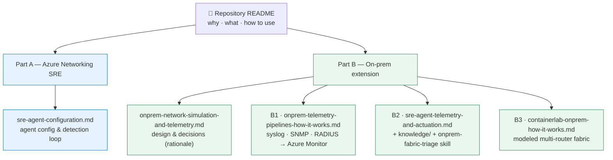

# Documentation

Human-facing documentation for the Azure Networking SRE Agent testbed. (Agent-facing
knowledge lives in [`../knowledge/`](../knowledge); the operational playbook for
working in this repo is [`../.github/skills/sre-agent/SKILL.md`](../.github/skills/sre-agent/SKILL.md).)

The project is one lab told in **two parts**. Start with the
[repository README](../README.md) for the high-level *why / what / how-to-use*, then
dive into the part you need.

---

## Part A — Azure Networking SRE *(the base story)*

A multi-hub hub-spoke Azure lab paired with the SRE Agent: deploy the topology, break
it with injected faults, and let the agent detect → investigate → root-cause → fix.
The lab and fault catalogue are documented in the [repository README](../README.md);
the agent itself is covered here:

> **Why networking SRE is different:** most SRE Agent demos are application/platform-
> centric, where telemetry points fairly directly at the culprit. Networking is the
> opposite — the same vague symptom (*"can't reach the storage account"*) can be rooted
> in any of many stacked layers (UDRs, NVA forwarding, BGP propagation, NSGs, dnsmasq,
> Private DNS links, PE system routes). The lab deliberately encodes **subtle
> misconfigurations that take experienced Azure admins hours** to isolate — so it can
> show the agent compressing that multi-layer correlation into minutes. See
> [*Why networking SRE is a different (and harder) problem*](../README.md#why-networking-sre-is-a-different-and-harder-problem).

- **[SRE Agent configuration — how it works](./sre-agent-configuration.md)**
  How a bare SRE Agent *resource* becomes a **working** agent: the two config planes
  (programmatic ARM + data plane), **how the configuration objects relate** (response
  plans → sub-agents → knowledge/skills/tools), the incident **detection** model
  (1-minute Alerts-API scan), the detect → investigate → root-cause → fix requirements,
  and how `configure-sre-agent.ps1 -Apply` applies the whole loop — including the custom
  (sub)agents and incident response plans. *(This agent plumbing is shared by Part B.)*

- **[SRE Agent — alert→incident mapping limitations](./sre-agent-incident-mapping-limitations.md)**
  Testing findings on where the agent's dedup/merge logic surprised us: distinct
  occurrences merging into one stale incident, and one root cause producing multiple
  uncorrelated incidents (a CM alert + a BGP-adjacency syslog never folded into one),
  plus related incident-lifecycle limitations and the workarounds in this repo.

- **[SRE Agent — live demo runbook](./demo-runbook.md)**
  The video/recording playbook: a one-command orchestrator (`scripts/demo.ps1`) that
  clears stale incidents, injects a curated fault (Azure UDR black-hole or on-prem OSPF
  cascade), live-tails the agent's detect → investigate → root-cause → fix, then reverts.
  Includes pre-flight checklist, talk track, timing, and troubleshooting.

---

## Part B — Extension to on-premises networking

On-prem is a different problem: devices speak **legacy telemetry protocols**
(syslog/SNMP/RADIUS) and the agent has **no built-in knowledge** of your fabric. This
part is organized around three concerns.

> **Read the design rationale first (optional but recommended):**
> **[On-prem simulation & telemetry — design & decisions](./onprem-network-simulation-and-telemetry.md)**
> — *why* we simulate on-prem devices the way we do, the options considered (soft
> router, Containerlab, vendor NOS, emulators, mock), the telemetry approaches, and
> the data-plane-vs-control-plane detection strategy. This backgrounder underpins
> all three concerns below.

### B1 — Bringing on-prem telemetry to Azure

*The goal that motivated the extension: get device telemetry into Azure Monitor.*

- **[On-prem telemetry pipelines — how it works](./onprem-telemetry-pipelines-how-it-works.md)**
  End-to-end wiring of the three pipelines — **syslog → Log Analytics**,
  **SNMP → Azure Monitor Metrics**, and **RADIUS AAA → Log Analytics** — with the
  device/collector/Azure config for each, cross-cutting concepts (DCR vs DCE, logs vs
  metrics, alerting), the file map, and a deploy-and-verify walkthrough.

### B2 — Teaching the SRE Agent: knowledge, skills & closing the loop

*What the agent must **know** to triage on-prem faults, and how it detects, reasons,
and acts on that telemetry.*

- **[How the SRE Agent consumes on-prem telemetry & closes the loop](./sre-agent-telemetry-and-actuation.md)**
  The read path (KQL/metric enrichment, RBAC) and how remediation *actuation* on
  legacy devices works via an in-VNet executor + RADIUS authN/authZ, including the
  identity/credential model (managed identity / WIF vs. long-lived secrets).
- **Agent knowledge & skills (in the repo, uploaded to the agent):**
  - [`../knowledge/onprem-network-topology.md`](../knowledge/onprem-network-topology.md) — fabric ground truth + deterministic route ownership.
  - [`../knowledge/onprem-ospf-fault-runbook.md`](../knowledge/onprem-ospf-fault-runbook.md) and [`../knowledge/onprem-bgp-fault-runbook.md`](../knowledge/onprem-bgp-fault-runbook.md) — targeted control-plane diagnosis.
  - [`../knowledge/onprem-telemetry-and-observability.md`](../knowledge/onprem-telemetry-and-observability.md) — exact KQL/metric schema.
  - [`../sre-agent-config/skills/onprem-fabric-triage/`](../sre-agent-config/skills/onprem-fabric-triage) — the signal-first, neighbor-aware OSPF/BGP triage skill, mirrored into the `onprem-fabric-clab` / `onprem-fabric-syslog` response plans.

### B3 — Modeling on-prem networking with Containerlab

*How the lab simulates a real multi-router on-prem site — and injects control-plane
faults that cascade to a detectable Connection Monitor failure.*

- **[Containerlab on-prem fabric — how it works](./containerlab-onprem-how-it-works.md)**
  The topology definition, how the veth wiring looks on the host, FRR + OSPF-underlay
  + eBGP-over-loopbacks config, the control-plane fault demo, and how the fabric is
  wired into the Azure data path (T3 / DNAT) so Connection Monitor can traverse it.
- **[`../infra/containerlab/README.md`](../infra/containerlab/README.md)** — quick
  reference for operating the fabric.

---

## At a glance

| Doc | Part | Type | Answers |
|-----|------|------|---------|
| [sre-agent-configuration](./sre-agent-configuration.md) | A | Implementation | How is the agent configured to detect & fix? |
| [sre-agent-incident-mapping-limitations](./sre-agent-incident-mapping-limitations.md) | A | Testing findings | Where does the agent's dedup/merge logic surprise us? |
| [demo-runbook](./demo-runbook.md) | A | Runbook | How do I record a live detect→fix demo? |
| [onprem-network-simulation-and-telemetry](./onprem-network-simulation-and-telemetry.md) | B (rationale) | Design / decisions | Which simulation & telemetry approach, and why? |
| [onprem-telemetry-pipelines-how-it-works](./onprem-telemetry-pipelines-how-it-works.md) | B1 | Implementation | How does telemetry actually reach Azure Monitor? |
| [sre-agent-telemetry-and-actuation](./sre-agent-telemetry-and-actuation.md) | B2 | Concept / design | How does the agent read telemetry & act on devices? |
| [containerlab-onprem-how-it-works](./containerlab-onprem-how-it-works.md) | B3 | Implementation | How is the multi-router fabric built & wired in? |

> **Build order note:** B1 (telemetry) is the *goal*, but you provision in dependency
> order — **model the devices (B3) → stream their telemetry (B1) → teach the agent
> (B2)**. The numbering above follows the *conceptual* narrative, not the deploy order.

---

## Related material outside `docs/`

- [`../README.md`](../README.md) — repository overview, quick start, fault catalogue,
  and the Part A / Part B map.
- [`../knowledge/`](../knowledge) — the full knowledge base uploaded to the agent.
- [`../sre-agent-config/`](../sre-agent-config) — declarative agent config, custom
  sub-agents, skills, and response plans.
- [`../.github/skills/sre-agent/SKILL.md`](../.github/skills/sre-agent/SKILL.md) —
  operational playbook for working in this repo.
