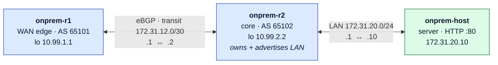
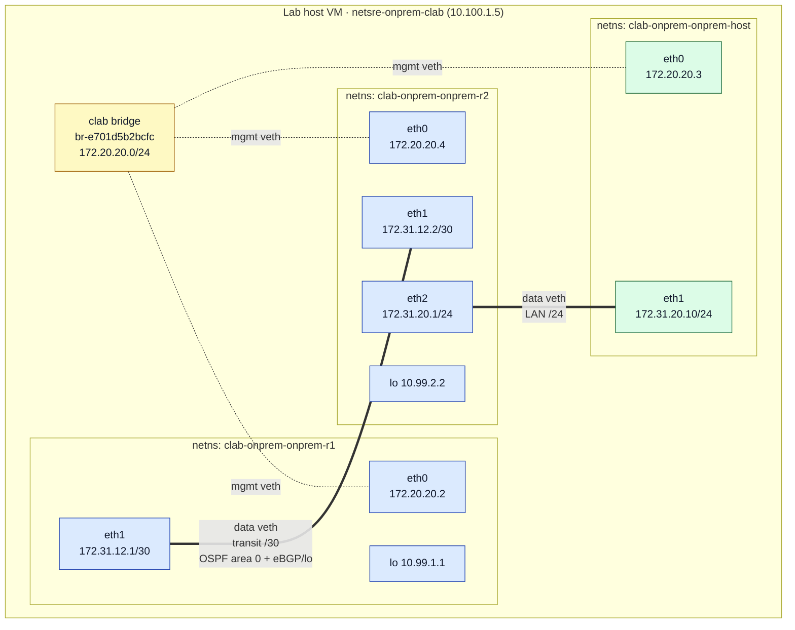
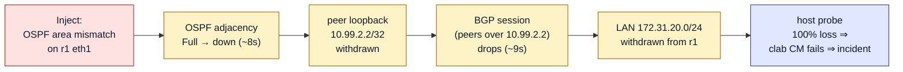
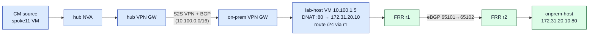

# Containerlab on-prem fabric — how it works and how it is wired

> **📍 Part B3 — Modeling on-prem networking with Containerlab.** See the [docs hub](./README.md).


This document explains the **Part A2 (high-fidelity)** on-prem simulation: a small
containerized network fabric that runs entirely inside a single Azure "lab host" VM
(`infra/modules/onprem-containerlab.bicep`, deployed by
`scripts/deploy-onprem.ps1 -Stage containerlab`). It is a **self-contained simulation**
— it does not sit in the Azure data path (that is Stage 1's FRR-on-VM design). Its purpose
is to provide realistic network-OS CLIs, a genuine routing control plane (eBGP), and
per-device syslog/SNMP telemetry from real router containers.

Every command output below was captured live from the deployed lab host
(`netsre-onprem-clab`) via `az vm run-command invoke`. Nothing here is illustrative — it is
the real state of the running fabric.

---

## 1. What Containerlab is

[Containerlab](https://containerlab.dev) is a tool that builds container-based network labs
from a declarative YAML topology. For each node it starts a container; for each link it
creates a **Linux `veth` pair** and moves one end into each node's network namespace. It
manages a Docker bridge for out-of-band management and injects each node's startup config
via bind mounts. No hypervisor, no VMs-in-VMs — just containers and kernel networking, so a
multi-router fabric boots in seconds on a single Linux host.

In this lab the nodes are:

| Node | Image | Role |
|------|-------|------|
| `onprem-r1` | `quay.io/frrouting/frr:9.1.0` | WAN-edge router (eBGP to core) |
| `onprem-r2` | `quay.io/frrouting/frr:9.1.0` | Core router — owns and advertises the on-prem LAN |
| `onprem-host` | `wbitt/network-multitool` | On-prem server / probe target (HTTP :80) behind the core |

[FRRouting](https://frrouting.org) is a full open-source routing stack (zebra + bgpd +
ospfd + …). It runs as Containerlab `kind: linux`; the image's entrypoint reads
`/etc/frr/daemons` to decide which routing daemons to launch and loads `/etc/frr/frr.conf`.

---

## 2. The topology definition

`infra/containerlab/onprem.clab.yml` (abridged):

```yaml
name: onprem
topology:
  defaults:
    kind: linux
  nodes:
    onprem-r1:
      image: quay.io/frrouting/frr:9.1.0
      binds:
        - configs/r1/daemons:/etc/frr/daemons
        - configs/r1/frr.conf:/etc/frr/frr.conf
        - configs/vtysh.conf:/etc/frr/vtysh.conf
      exec: ["ip link set dev eth1 up"]
    onprem-r2:
      image: quay.io/frrouting/frr:9.1.0
      binds:
        - configs/r2/daemons:/etc/frr/daemons
        - configs/r2/frr.conf:/etc/frr/frr.conf
        - configs/vtysh.conf:/etc/frr/vtysh.conf
      exec: ["ip link set dev eth1 up", "ip link set dev eth2 up"]
    onprem-host:
      image: wbitt/network-multitool:latest
      exec:
        - ip addr add 172.31.20.10/24 dev eth1
        - ip link set dev eth1 up
        - ip route replace default via 172.31.20.1
  links:
    - endpoints: ["onprem-r1:eth1", "onprem-r2:eth1"]   # 172.31.12.0/30 transit
    - endpoints: ["onprem-r2:eth2", "onprem-host:eth1"] # 172.31.20.0/24 LAN
```

### Logical wiring

```
                 eBGP (AS 65101 <-> AS 65102)
   onprem-r1 ────────────────────────────────── onprem-r2 ───────────── onprem-host
  (WAN edge)   eth1 .1        transit        .2 eth1   eth2 .1   LAN   .10 eth1
  lo 10.99.1.1     172.31.12.0/30               lo 10.99.2.2   172.31.20.0/24
                                            advertises 172.31.20.0/24 into BGP

  (every node also has eth0 on the 172.20.20.0/24 Containerlab management bridge)
```



The design intent: `onprem-r2` **owns the LAN** (`172.31.20.0/24`) and advertises it into
eBGP. `onprem-r1` only reaches the LAN **via the BGP-learned route**. So breaking the
r1↔r2 BGP session (or the transit link) **withdraws the LAN route** — a realistic
control-plane fault whose blast radius is directly observable. This is demonstrated in
§7 below.

---

## 3. Deploying the fabric on the host

The host VM's cloud-init installs Docker + Containerlab, clones this repo, and a systemd
unit (`onprem-clab.service`) runs `containerlab deploy` on boot (and re-deploys after a
reboot, because `veth` links do not survive a reboot). The resulting fabric:

```console
$ sudo containerlab inspect -t onprem.clab.yml
           Name                     Kind/Image             State     IPv4/6 Address
 clab-onprem-onprem-host  linux                           running  172.20.20.3
                          wbitt/network-multitool:latest           3fff:172:20:20::3
 clab-onprem-onprem-r1    linux                           running  172.20.20.2
                          quay.io/frrouting/frr:9.1.0              3fff:172:20:20::2
 clab-onprem-onprem-r2    linux                           running  172.20.20.4
                          quay.io/frrouting/frr:9.1.0              3fff:172:20:20::4

$ sudo docker ps --format 'table {{.Names}}\t{{.Image}}\t{{.Status}}'
NAMES                     IMAGE                            STATUS
clab-onprem-onprem-host   wbitt/network-multitool:latest   Up 2 minutes
clab-onprem-onprem-r2     quay.io/frrouting/frr:9.1.0      Up 2 minutes
clab-onprem-onprem-r1     quay.io/frrouting/frr:9.1.0      Up 2 minutes
```

Note the container naming convention: `clab-<labname>-<nodename>`, so `onprem-r1` becomes
`clab-onprem-onprem-r1`.

---

## 4. How the wiring actually looks on the host

Physically, every node is a network namespace on the host VM. Management (`eth0`) links
attach to a shared Docker bridge; the point-to-point data links are `veth` pairs whose two
ends live inside two namespaces (so they never appear on the host). The full picture:



Solid double lines are the data-plane `veth` pairs (both ends inside namespaces); dotted
lines are the management `veth` links to the shared `clab` bridge (host-visible). The rest
of this section proves each of these links from live command output.

### 4.1 Management network — a Docker bridge

Containerlab creates one Docker bridge network (named `clab`) for out-of-band management.
Every node's `eth0` attaches to it, and the host side of each management `veth` shows up on
the host:

```console
$ sudo docker network ls
NETWORK ID     NAME      DRIVER    SCOPE
0a7609d2d537   bridge    bridge    local
e701d5b2bcfc   clab      bridge    local
e1324ff9cda6   host      host      local
103f6a488982   none      null      local

$ ip -br link
lo               UNKNOWN        00:00:00:00:00:00 <LOOPBACK,UP,LOWER_UP>
eth0             UP             7c:1e:52:c2:0f:96 <BROADCAST,MULTICAST,UP,LOWER_UP>
docker0          DOWN           aa:b3:e7:b0:5f:c3 <NO-CARRIER,BROADCAST,MULTICAST,UP>
br-e701d5b2bcfc  UP             a6:26:07:5c:35:9e <BROADCAST,MULTICAST,UP,LOWER_UP>
veth79d65ed@if2  UP             36:6c:55:08:83:c9 <BROADCAST,MULTICAST,UP,LOWER_UP>
vethb91bb73@if2  UP             42:f8:80:7e:80:26 <BROADCAST,MULTICAST,UP,LOWER_UP>
veth8635d46@if2  UP             f2:b8:1d:f5:a5:fe <BROADCAST,MULTICAST,UP,LOWER_UP>
```

- `br-e701d5b2bcfc` is the `clab` management bridge (the bridge id matches the network id
  `e701d5b2bcfc`). Its subnet is `172.20.20.0/24`.
- The three `vethXXXX@if2` interfaces are the host ends of the three nodes' `eth0`
  management links (`@if2` = the peer is ifindex 2, i.e. `eth0`, inside each node's
  namespace).
- `docker0` is the default Docker bridge — unused by the lab (NO-CARRIER).

### 4.2 Data-plane links — veth pairs inside the namespaces

The **point-to-point data links** (`r1:eth1↔r2:eth1` and `r2:eth2↔host:eth1`) are `veth`
pairs whose **both** ends live inside container namespaces, so they do **not** appear on the
host — only their two endpoints inside the nodes do. Each container's namespace is a file
under Docker's netns directory:

```console
$ sudo ls -l /var/run/docker/netns
-r--r--r-- 1 root root 0 Jul 29 10:11 547b4d397fc6
-r--r--r-- 1 root root 0 Jul 29 10:11 7eeea0a06c44
-r--r--r-- 1 root root 0 Jul 29 10:11 b5eea331db29
```

(`ip netns list` shows nothing because Docker keeps its namespaces here rather than in
`/run/netns`.)

You can prove the veth peering by matching interface indices across namespaces. The
`ethN@ifM` suffix names the peer's ifindex, and `link-netnsid` names the peer namespace:

```console
# r1's transit link — peer is ifindex 19
$ docker exec clab-onprem-onprem-r1 ip -d link show eth1
20: eth1@if19: <BROADCAST,MULTICAST,UP,LOWER_UP> mtu 9500 ... link-netnsid 1
    veth ...

# r2's transit link — index 19, peer is ifindex 20  ==> pairs with r1:eth1 above
$ docker exec clab-onprem-onprem-r2 ip -d link show eth1
19: eth1@if20: <BROADCAST,MULTICAST,UP,LOWER_UP> mtu 9500 ... link-netnsid 1
    veth ...

# r2's LAN link — index 21, peer is ifindex 22 (in the host node's namespace)
$ docker exec clab-onprem-onprem-r2 ip -d link show eth2
21: eth2@if22: <BROADCAST,MULTICAST,UP,LOWER_UP> mtu 9500 ... link-netnsid 2
    veth ...

# onprem-host's LAN link — peer is ifindex 21  ==> pairs with r2:eth2 above
$ docker exec clab-onprem-onprem-host ip -br addr
lo               UNKNOWN        127.0.0.1/8 ::1/128
eth0@if17        UP             172.20.20.3/24 ...
eth1@if21        UP             172.31.20.10/24 ...
```

So the physical graph is:

```
r1:eth1(idx20) <== veth ==> r2:eth1(idx19)     [transit 172.31.12.0/30]
r2:eth2(idx21) <== veth ==> host:eth1(idx?→peer21)  [LAN 172.31.20.0/24]
```

Note the MTU of `9500` on the data links — Containerlab sets jumbo-capable veths by default.

---

## 5. Inside a router — FRR configuration and interfaces

`onprem-r1` interface view (from FRR's own CLI, `vtysh`):

```console
$ docker exec clab-onprem-onprem-r1 vtysh -c "show interface brief"
Interface       Status  VRF             Addresses
---------       ------  ---             ---------
eth0            up      default         172.20.20.2/24     <- management
eth1            up      default         172.31.12.1/30     <- transit to r2
lo              up      default         10.99.1.1/32       <- router-id / loopback
```

Its running configuration (`configs/r1/frr.conf`, loaded at start):

```console
$ docker exec clab-onprem-onprem-r1 vtysh -c "show running-config"
frr version 9.1
hostname onprem-r1
log syslog informational
service integrated-vtysh-config
!
interface lo
 ip address 10.99.1.1/32
!
interface eth1
 description transit-to-onprem-r2
 ip address 172.31.12.1/30
 ip ospf network point-to-point
 ip ospf hello-interval 2
 ip ospf dead-interval 8
!
router bgp 65101
 bgp router-id 10.99.1.1
 no bgp ebgp-requires-policy
 neighbor 10.99.2.2 remote-as 65102
 neighbor 10.99.2.2 description onprem-r2-core
 neighbor 10.99.2.2 update-source lo
 neighbor 10.99.2.2 ebgp-multihop 2
 neighbor 10.99.2.2 timers 3 9
 !
 address-family ipv4 unicast
  network 172.31.11.0/30
 exit-address-family
!
router ospf
 ospf router-id 10.99.1.1
 network 172.31.12.0/30 area 0
 network 10.99.1.1/32 area 0
!
```

`onprem-r2` mirrors this with AS `65102`, loopback `10.99.2.2/32`, and additionally owns
`eth2 = 172.31.20.1/24` and advertises `network 172.31.20.0/24` — the on-prem LAN — into
BGP. **OSPF area 0** runs over the transit on both routers and advertises the loopbacks.

FRR chooses which daemons to run from `/etc/frr/daemons`; the relevant lines are
`zebra=yes`, `bgpd=yes`, and `ospfd=yes`. **These files must have Unix (LF) line
endings** — see §8.

---

## 6. The control plane — OSPF underlay + eBGP over loopbacks

**OSPF is the IGP underlay.** It forms an adjacency over the directly-connected transit
`172.31.12.0/30` and advertises the router loopbacks (`10.99.1.1/32`, `10.99.2.2/32`).
**BGP then peers loopback-to-loopback** (`update-source lo`, `ebgp-multihop 2`), so the
BGP session can only come up *after* OSPF has installed the peer loopback route — BGP
rides the OSPF underlay:

```console
$ docker exec clab-onprem-onprem-r1 vtysh -c "show ip ospf neighbor"
Neighbor ID     Pri State      Up Time   Dead Time Address       Interface
10.99.2.2         1 Full/-     1m52s     7.920s    172.31.12.2   eth1:172.31.12.1

$ docker exec clab-onprem-onprem-r1 vtysh -c "show ip bgp summary"
Neighbor        V         AS   MsgRcvd   MsgSent   ... Up/Down State/PfxRcd   PfxSnt Desc
10.99.2.2       4      65102       163       163   ... 00:01:24            1        2 onprem-r2-core
```

OSPF neighbor `Full` and BGP `State/PfxRcd = 1` (a number, not `Idle`/`Active`) means the
underlay is up and the loopback-peered session is **Established**, with r1 receiving the
LAN prefix from r2. The resulting RIB on r1:

```console
$ docker exec clab-onprem-onprem-r1 vtysh -c "show ip route"
K>* 0.0.0.0/0 [0/0] via 172.20.20.1, eth0            <- default via mgmt bridge
C>* 10.99.1.1/32 is directly connected, lo
O>* 10.99.2.2/32 [110/10] via 172.31.12.2, eth1      <- r2 loopback, learned via OSPF (underlay)
C>* 172.20.20.0/24 is directly connected, eth0
C>* 172.31.12.0/30 is directly connected, eth1
B>* 172.31.20.0/24 [20/0] via 172.31.12.2, eth1      <- the on-prem LAN, learned via BGP (recursive over 10.99.2.2)
```

The `O>*` on `10.99.2.2/32` (OSPF) plus the `B>*` on `172.31.20.0/24` (BGP, **recursive
over the OSPF-learned loopback**) is the crux of the design: **r1 reaches the on-prem LAN
via BGP, but that BGP session itself depends on the OSPF underlay.** Break OSPF and the
whole chain collapses (see §7). End-to-end reachability across the fabric works:

```console
$ docker exec clab-onprem-onprem-r1 ping -c 3 172.31.20.10
64 bytes from 172.31.20.10: seq=0 ttl=63 time=0.089 ms
64 bytes from 172.31.20.10: seq=1 ttl=63 time=0.044 ms
64 bytes from 172.31.20.10: seq=2 ttl=63 time=0.027 ms
--- 172.31.20.10 ping statistics ---
3 packets transmitted, 3 packets received, 0% packet loss
```

`ttl=63` (one less than the Linux default 64) confirms the packet was routed through **one**
hop — `onprem-r2` — to reach the host.

---

## 7. Fault demo — an OSPF underlay fault cascades to the data path

The headline fault for this fabric is an **OSPF adjacency break**. Because BGP peers over
the OSPF-learned loopbacks, an IGP fault cascades all the way to the data path — the
classic "IGP underlay + BGP over loopbacks" failure mode. The causal chain:



Inject/revert with `scripts/inject-fault.ps1 -Scenario clab-ospf-area-mismatch [-Revert]`.
Captured live (root cause is OSPF, first data-plane symptom is the CM failing):

```console
# OSPF adjacency gone; peer loopback withdrawn:
$ docker exec clab-onprem-onprem-r1 vtysh -c "show ip ospf neighbor"      # (empty)
$ docker exec clab-onprem-onprem-r1 vtysh -c "show ip route 10.99.2.2"    # gone

# Cascade: BGP (peered over 10.99.2.2) drops, LAN withdrawn, data path broken:
$ docker exec clab-onprem-onprem-r1 vtysh -c "show ip bgp summary" | grep 10.99.2.2
10.99.2.2       4      65102 ...      Connect         0        onprem-r2-core
$ docker exec clab-onprem-onprem-r1 vtysh -c "show ip route 172.31.20.0/24"
% Network not in table
$ docker exec clab-onprem-onprem-r1 ping -c 2 -W 1 172.31.20.10
2 packets transmitted, 0 packets received, 100% packet loss
```

A **pure BGP** fault produces the same data-plane symptom without touching OSPF — useful
for teaching the agent to find the *root layer*. Inject with
`scripts/inject-fault.ps1 -Scenario clab-bgp-session-down`; the mechanics
(`neighbor 10.99.2.2 shutdown` on r1) withdraw the LAN while OSPF stays `Full`:

```console
# Inject: administratively shut down the eBGP neighbor on r1 (heredoc into vtysh)
$ docker exec -i clab-onprem-onprem-r1 vtysh <<'EOF'
configure terminal
router bgp 65101
 neighbor 10.99.2.2 shutdown
EOF

# The LAN route is immediately withdrawn from r1's table:
$ docker exec clab-onprem-onprem-r1 vtysh -c "show ip route 172.31.20.0/24"
% Network not in table

# And the data path is genuinely broken:
$ docker exec clab-onprem-onprem-r1 ping -c 2 -W 1 172.31.20.10
2 packets transmitted, 0 packets received, 100% packet loss

# Revert: bring the neighbor back
$ docker exec -i clab-onprem-onprem-r1 vtysh <<'EOF'
configure terminal
router bgp 65101
 no neighbor 10.99.2.2 shutdown
EOF

$ docker exec clab-onprem-onprem-r1 vtysh -c "show ip route 172.31.20.0/24"
Routing entry for 172.31.20.0/24
  Known via "bgp", distance 20, metric 0, best
  Last update 00:00:03 ago
    10.99.2.2 (recursive), weight 1
```

This is the kind of control-plane event the design doc discusses attaching data-plane
probes to (see `docs/onprem-network-simulation-and-telemetry.md`, Part D / §10): the failure
is in the control plane (BGP) but its effect is observable in the data plane (the LAN
becomes unreachable), so a Connection Monitor–style probe would catch it.

### Scripted fault catalog

This fault (and six more) is now injectable through `scripts/inject-fault.ps1` under the
**Containerlab** category — each with a clean `-Revert`:

| Scenario | Layer | Trips the clab Connection Monitor? |
|----------|-------|-----------------------------------|
| `clab-ospf-area-mismatch` | OSPF (loopbacks only) | No — syslog signal only |
| `clab-ospf-mtu-mismatch` | OSPF | No — syslog signal only |
| `clab-ospf-network-type-mismatch` | OSPF | No — syslog signal only |
| `clab-bgp-session-down` | BGP (LAN) | Yes |
| `clab-lan-route-withdraw` | BGP origination | Yes |
| `clab-bgp-prefix-filter` | BGP policy (session stays up) | Yes |
| `clab-transit-link-down` | L1/L2 transit | Yes |

```powershell
.\scripts\inject-fault.ps1 -Scenario clab-bgp-session-down
.\scripts\inject-fault.ps1 -Scenario clab-bgp-session-down -Revert
```

The script drives FRR via a **heredoc into `docker exec -i <node> vtysh`** rather than
multiple `vtysh -c` flags — a single multi-`-c` invocation does *not* stay in config mode, so
route-map/prefix-list edits silently fail to commit. The SRE Agent's matching triage
procedure lives in the `onprem-fabric-triage` skill
([`sre-agent-config/skills/onprem-fabric-triage/`](../sre-agent-config/skills/onprem-fabric-triage))
and the `onprem-fabric-clab` / `onprem-fabric-syslog` response plans.

---

## 8. Gotcha: config files must use LF line endings

FRR's image entrypoint **sources** `/etc/frr/daemons` as a shell fragment. If the file is
checked out with Windows CRLF line endings, every value gains a trailing carriage return.
The symptom is subtle but fatal: `bgpd_options="-A 127.0.0.1"` becomes
`-A 127.0.0.1<CR>`, and bgpd fails to bind:

```
/etc/frr/daemons: line 19: $'\r': command not found
BGP: getaddrinfo failed: Name does not resolve
bgpd failed to start, exited 1
```

zebra still starts (so interfaces/addresses appear), which makes this look like "BGP just
won't peer" rather than a line-ending problem. `show running-config` even shows no
`router bgp` stanza, because vtysh silently drops it when bgpd is not running.

**Fix:** the repo ships a `.gitattributes` that forces LF for the Containerlab configs,
cloud-init and shell/yaml/conf files:

```gitattributes
infra/containerlab/configs/**   text eol=lf
infra/cloud-init/**             text eol=lf
*.sh  *.yml  *.yaml  *.conf     text eol=lf
```

Verify inside the container with `od -c`:

```console
$ docker exec clab-onprem-onprem-r1 sh -c "grep bgpd=yes /etc/frr/daemons | od -c | head -1"
0000000   b   g   p   d   =   y   e   s  \n        <- LF only; a trailing \r here breaks bgpd
```

---

## 9. Day-to-day operations

```console
# Deploy / destroy the fabric
sudo containerlab deploy  -t onprem.clab.yml
sudo containerlab destroy -t onprem.clab.yml
sudo containerlab deploy  -t onprem.clab.yml --reconfigure   # re-apply configs

# Enter a router CLI
docker exec -it clab-onprem-onprem-r1 vtysh

# Useful FRR show commands
show ip bgp summary
show ip route
show bgp ipv4 unicast
show interface brief

# The host VM redeploys the fabric on boot via systemd:
systemctl status onprem-clab.service
```

### Upgrading to vendor-grade fidelity

The default images are free and need no vendor account. For real vendor CLI, gNMI streaming
telemetry and SNMP MIBs, swap the router nodes to **Nokia SR Linux** (publicly pullable):

```yaml
onprem-r1:
  kind: nokia_srlinux
  image: ghcr.io/nokia/srlinux
```

See `infra/containerlab/README.md` for the SR Linux config equivalents.

---

## 10. Wiring into the Azure data path (T3 / D3c)

As deployed, the fabric is **self-contained inside the lab-host VM** — nothing in Azure routes
through it yet. That is deliberate: the in-path detection design for Stage 1 is FRR-on-a-VM, and
bridging the *containerized* data plane into Azure is the advanced **T3 / D3c** option. This section
records **how** you would wire it in and **which routing mechanism** to use — the design rationale
lives in
[`docs/onprem-network-simulation-and-telemetry.md`](onprem-network-simulation-and-telemetry.md) §D6.

The container LAN `172.31.20.0/24` is internal to the VM (`10.100.1.5`) in the on-prem VNet, so Azure
must (1) route that prefix toward on-prem across the VPN and (2) the on-prem VNet must steer it into
the VM, which forwards it into the fabric. Three approaches, summarized:

| Option | Azure learns the prefix via | Extra components | Azure-side fault signal |
|--------|-----------------------------|------------------|-------------------------|
| **A. BGP + Azure Route Server** | lab-host FRR peers ARS → VPN GW → hubs | Azure Route Server (~$290/mo, `/27` subnet) | route **withdrawal** |
| **B. Static UDR + Local Network Gateway** | GatewaySubnet UDR + LNG prefixes | none | data-plane **blackhole** |
| **C. DNAT on the lab host** *(recommended)* | reuses `10.100.1.5` (already BGP-advertised in `10.100.0.0/16`) | none | data-plane **blackhole** |

> **⚠️ Option B caveat:** with **BGP enabled on the VPN connections** (as in this lab), Azure
> **ignores the Local Network Gateway address space** (it only uses the LNG's BGP-peer `/32`). So the
> LNG-static route only works if you **disable BGP** on the on-prem↔hub connections. See §D6.

### Recommended recipe — Option C (DNAT), no Azure routing changes

Because `10.100.1.5` is already reachable from Azure (its `/16` is advertised over the existing VPN
BGP), you only touch the lab-host VM. Route the fabric prefix **via r1** so DNAT'd probe traffic
crosses the eBGP session (making an r1↔r2 fault break the probe):

```bash
# On the lab-host VM (add to cloud-init):
sysctl -w net.ipv4.ip_forward=1
# send fabric-bound traffic through r1 (mgmt IP) so it traverses r1 --eBGP--> r2 --> host
ip route replace 172.31.20.0/24 via 172.20.20.2
# publish onprem-host (172.31.20.10:80) on the VM's own Azure IP
iptables -t nat -A PREROUTING  -d 10.100.1.5 -p tcp --dport 80 -j DNAT --to-destination 172.31.20.10:80
iptables -t nat -A POSTROUTING -d 172.31.20.10 -p tcp --dport 80 -j MASQUERADE
```

Also enable **NIC-level IP forwarding** on the VM's Azure NIC (the repo's NVAs already do this).
Point a Connection Monitor test group at `http://10.100.1.5:80` from the `spoke11`/`spoke21` sources.



Break the fabric (`neighbor 10.99.2.2 shutdown` on r1, or the OSPF area-mismatch cascade as
in §7) and the probe to `10.100.1.5:80`
now black-holes at r1 — a **data-plane** failure that Connection Monitor catches, driven by a **real
control-plane** event inside the fabric. Revert with `no neighbor 10.99.2.2 shutdown`.


---

*Companion docs:*
[On-prem simulation & telemetry (design/decisions)](./onprem-network-simulation-and-telemetry.md)
· [Telemetry pipelines — how it works](./onprem-telemetry-pipelines-how-it-works.md)
· [SRE Agent — consumes telemetry & closes the loop](./sre-agent-telemetry-and-actuation.md)
