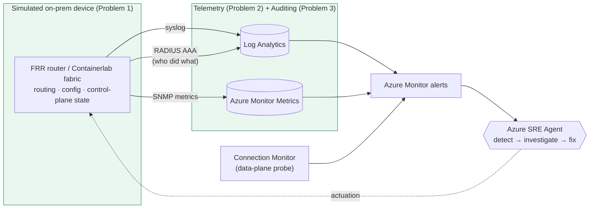

# Extending the SRE Agent Story to On-Premises Networking

> **📍 Part B — design rationale** that underpins B1 (telemetry), B2 (agent knowledge/skills), and B3 (Containerlab modeling). See the [docs hub](./README.md).


> **Status:** Design exploration / RFC
> **Audience:** Maintainers of `networking-sre-agent`
> **Goal:** Evaluate how to (a) *simulate* on-premises network devices, (b) make their
> *telemetry* (syslog **and** metrics) available to the Azure SRE Agent, and (c) surface their
> *audit trail* (AAA / config-change logs), in a way that fits the existing multi-hub
> hub-and-spoke testbed.

---

## 1. Context — current state

The current "on-premises" side of the lab (`infra/modules/onprem.bicep`) is **not** a network
device at all. It is:

- an Azure VNet (`10.100.0.0/16`) with a **route-based VPN Gateway** (BGP ASN 65100),
- a single **plain Ubuntu 22.04 test VM** (a *workload*, not a router),
- an NSG + NAT Gateway for outbound, and
- the **Network Watcher Agent** extension for Connection Monitor probes.

So "on-prem" today is really *another Azure VNet that pretends to be on-prem via S2S VPN + BGP*.
Telemetry reaching the SRE Agent is **exclusively Azure-native**: Connection Monitor results,
Azure Monitor metrics (VPN Gateway, LB), and Activity Log. There is **no device-level telemetry**
(no syslog, no SNMP, no streaming telemetry) and **no simulated router/firewall/switch** whose
config or control plane can fail in an interesting way.

The extension therefore has **three** independent problems:

1. **Simulation** — introduce something that *behaves like* an on-prem network device (routing,
   config, control-plane state that can break).
2. **Telemetry** — get that device's operational signals (syslog, metrics) into a place the SRE
   Agent can reason over (Azure Monitor / Log Analytics), the same way Connection Monitor alerts
   drive it today.
3. **Auditing** — capture *who changed what, when, and whether it was authorized*. On Azure this is
   the **Activity Log** the SRE Agent already correlates against; on-prem network devices instead
   authenticate/authorize/account operators via **AAA** protocols (**TACACS+**, **RADIUS**), which
   have no native Azure equivalent and must be bridged in.

> **Terminology note:** the metrics protocol for legacy network gear is **SNMP** (Simple Network
> Management Protocol). The rest of this document uses SNMP.

### The three problems at a glance



---

## 2. Part A — Simulating on-premises network devices

The realism obtained is a spectrum. Higher fidelity = higher cost, licensing friction, and
operational weight. Five broad options, roughly in increasing fidelity:

### A1. "Soft router" on a normal Linux VM (FRRouting / BIRD / VyOS) — *lowest friction*
Turn the existing on-prem Ubuntu VM (or a new one) into a router using open-source routing stacks:

- **FRRouting (FRR)** — production-grade BGP/OSPF/IS-IS, Cisco-like `vtysh` CLI, emits **syslog**
  and exposes counters. Already conceptually aligned: the hub NVAs are Ubuntu boxes, so this reuses
  existing patterns and cloud-init.
- **VyOS** — full network-OS *distribution* (Juniper-like CLI, config commit/rollback, built-in
  BGP/OSPF/firewall/VPN). Feels much more like "a device" than raw Linux and has an Azure image.
- **BIRD** — lightweight, BGP/OSPF only.

**Pros:** free, Azure-native VM (no nested virt), scriptable faults via cloud-init/`az vm run-command`,
native syslog, good BGP fidelity for the existing VPN/BGP story.
**Cons:** not a "real" vendor NOS — no vendor-specific syslog message IDs, no vendor MIBs, data-plane
features are Linux-flavored. Good enough for *control-plane* incident stories.

### A2. Containerized network OS via **Containerlab** — *high fidelity, modern*
[Containerlab](https://containerlab.dev/) orchestrates container-based NOSes on a single Linux host:

- Free/openly available images: **Nokia SR Linux**, **Arista cEOS** (free with account), **FRR**,
  **SONiC**, **Cisco XRd**.
- Topologies are declarative YAML; a small "on-prem campus/WAN" (a couple of
  routers + a switch) can run inside one Azure VM.

**Pros:** realistic vendor CLIs, real syslog formats, real SNMP MIBs / gNMI streaming telemetry,
fast to spin up/tear down, fault injection = `containerlab` + config pushes.
**Cons:** needs a beefy Linux host VM; some images need a (free) vendor account; SR Linux/Arista
data-plane is containerized (control-plane-accurate, data-plane simplified). Best telemetry realism
for the least licensing pain.

### A3. VM-based virtual appliances (vendor NOS images) — *highest fidelity, licensing cost*
Run real vendor images as Azure VMs or nested under a hypervisor:

- **Cisco Catalyst 8000V / CSR1000v**, **Arista vEOS**, **Juniper vMX / vSRX**,
  **Palo Alto VM-Series**, **Fortinet FortiGate-VM** — several are in the **Azure Marketplace**.
- Marketplace NVAs can attach straight to the on-prem VNet and terminate the S2S VPN / speak BGP.

**Pros:** production-identical CLI, syslog, SNMP MIBs, streaming telemetry, WAF/IPS features.
**Cons:** **licensing** (BYOL or hourly Marketplace fees), larger VM SKUs, slower deploy, and cost.
Overkill unless vendor-accurate incidents are specifically required.

### A4. Nested emulation — **EVE-NG / GNS3 / Cisco Modeling Labs** on one Azure VM
Run a network emulator inside a single VM that supports **nested virtualization**
(Azure `Dv3/Ev3/Dv5` families support it). Import IOSv/vIOS/other qcow2 images and build arbitrarily
complex multi-device topologies.

**Pros:** richest topologies, closest to a real "on-prem network" with many device types.
**Cons:** heaviest to automate (not IaC-friendly), image licensing, nested-virt SKU constraints,
fragile for CI/repeatable fault injection. Great for demos, poor for a repeatable testbed.

### A5. Pure simulation / mock telemetry — *no real device at all*
Skip the device entirely and **generate synthetic telemetry** (fake syslog lines + fake SNMP/metric
series) that describe an imaginary device, then break the *data* on demand.

**Pros:** trivial, cheap, fully deterministic fault injection, zero licensing.
**Cons:** no real control/data plane — the agent can't actually *verify* anything, so root-cause
stories are shallow. Useful as a **stopgap** to build the telemetry pipeline before a real device
exists.

### Simulation comparison

| Option | Fidelity | Cost/Licensing | IaC-friendly | Nested virt? | Real syslog | Real SNMP/telemetry |
|--------|----------|----------------|--------------|--------------|-------------|---------------------|
| A1 FRR/VyOS on VM | Medium (control plane) | Free | ✅ High | No | ✅ (Linux) | Partial (net-snmp) |
| A2 Containerlab | High | Free/free-tier | ✅ Medium | No (containers) | ✅ Vendor | ✅ Vendor MIBs/gNMI |
| A3 Vendor VM/Marketplace | Very high | 💲 BYOL/hourly | ✅ Medium | No | ✅ Vendor | ✅ Vendor |
| A4 EVE-NG/GNS3 nested | Very high | 💲 Images | ❌ Low | Yes | ✅ Vendor | ✅ Vendor |
| A5 Synthetic telemetry | Low | Free | ✅ High | No | Faked | Faked |

**Recommendation:** start with **A1 (FRR or VyOS)** to reuse the existing VM/cloud-init/BGP patterns,
and offer **A2 (Containerlab)** as an optional high-fidelity add-on. This keeps the lab deployable,
cheap, and repeatable while still producing *real* syslog and SNMP.

---

## 3. Part B — Getting telemetry to the SRE Agent

The SRE Agent reasons over **Azure Monitor** (Log Analytics logs + metrics + alerts). So every
approach below funnels device signals into a **Log Analytics workspace** and/or an **Azure Monitor
(Prometheus) workspace**, then exposes them via alerts — exactly like the Connection Monitor path
that already drives the agent.

### 3.1 Syslog

The standard pattern:

```
Network device(s) ──UDP/TCP 514 (syslog / CEF)──▶ Linux "collector" VM
        (rsyslog / syslog-ng)  ──▶  Azure Monitor Agent (AMA)  ──▶  DCR  ──▶  Log Analytics
                                                                     └─ Syslog / CommonSecurityLog table
```

Key points:
- **AMA replaces the legacy Log Analytics agent (MMA/OMS), which is retired.** Use **AMA** + a
  **Data Collection Rule (DCR)** with the **Syslog** data source (facilities/severities) — or the
  **CEF** data source (→ `CommonSecurityLog`) for firewall/security devices.
- The device itself does **not** run AMA. It just points its syslog exporter at the collector VM.
  AMA runs on the collector.
- For a *non-Azure* device, use **Azure Arc** to project it as a server and install AMA; but
  because the simulated "on-prem" lives in Azure, AMA can run on an Azure collector VM directly.
- Parsing: vendor syslog is free-form. Normalize with rsyslog templates or a
  **transformKql** in the DCR to extract severity, facility, message-ID, interface, etc.

This gives the agent a `Syslog` / `CommonSecurityLog` table it can KQL over and alert on (e.g.
`%BGP-5-ADJCHANGE`, interface flaps, IPsec SA down).

### 3.2 Metrics — the hard part (SNMP and friends)

AMA does **not** collect SNMP. Legacy gear predates push-based telemetry, so a **poller** is needed
that turns SNMP (or newer streaming telemetry) into something Azure Monitor stores. Four viable
approaches:

#### B1. **Telegraf** with the SNMP input plugin → Azure Monitor *(recommended for legacy gear)*
- Run [Telegraf](https://github.com/influxdata/telegraf) on the collector VM.
- `inputs.snmp` polls device OIDs/MIBs on a schedule.
- Output options:
  - `outputs.azure_monitor` → Azure Monitor **custom metrics** (per-resource, alertable), **or**
  - `outputs.http` → **Logs Ingestion API** (DCR + custom `_CL` table in Log Analytics), **or**
  - Prometheus remote-write → Azure Monitor workspace.
- **Pros:** huge library of vendor SNMP MIBs, mature, single agent can also do NetFlow/gNMI/ping.
- **Cons:** managing the Telegraf config/MIBs; custom-metrics dimensionality limits apply.

#### B2. **Prometheus `snmp_exporter` + Azure Monitor managed Prometheus**
- `snmp_exporter` scrapes SNMP and exposes Prometheus metrics; an agent (AMA Prometheus / OTel)
  remote-writes to an **Azure Monitor workspace**; visualize in **Azure Managed Grafana**.
- **Pros:** cloud-native metrics model, PromQL, great dashboards, alert rules → the agent.
- **Cons:** more moving parts (`snmp_exporter` + `generator.yml` per MIB); metrics only.

#### B3. **OpenTelemetry Collector** (SNMP receiver / gNMI) → Azure Monitor exporter
- The OTel Collector `snmpreceiver` (or a gNMI receiver for modern NOSes) → `azuremonitorexporter`
  or Prometheus remote-write.
- **Pros:** one pipeline for logs+metrics+traces, future-proof, vendor-neutral.
- **Cons:** SNMP receiver is less mature than Telegraf's; more assembly.

#### B4. **Streaming telemetry (gNMI / model-driven)** — for *modern* NOSes only
- SR Linux / Arista / Cisco XR push **gNMI/gRPC** telemetry (subscriptions) — no polling, low
  latency, structured. Consume via Telegraf `inputs.gnmi` or OTel and forward as above.
- **Pros:** the "right" modern answer; rich, high-frequency, structured.
- **Cons:** only available on modern devices (so pairs with simulation A2/A3, not legacy emulation).

#### Bonus: flow telemetry (NetFlow / IPFIX / sFlow)
For *traffic* (not device-health) telemetry, add a **NetFlow/IPFIX/sFlow** collector (Telegraf,
`nfdump`, or a vendor collector) → Log Analytics. This is the on-prem analog of NSG flow logs /
Traffic Analytics and enables "who's talking to whom" incident stories.

### Telemetry comparison

| Signal | Protocol | Collector | Lands in | Best for |
|--------|----------|-----------|----------|----------|
| Logs/events | Syslog / CEF | rsyslog + **AMA** + DCR | `Syslog` / `CommonSecurityLog` | Config changes, BGP/IPsec events |
| Health metrics | **SNMP** | **Telegraf** / snmp_exporter / OTel | Azure Monitor metrics or `_CL` table | CPU, mem, interface counters, errors |
| Modern metrics | **gNMI** | Telegraf/OTel | Azure Monitor / Prometheus | High-fidelity streaming (A2/A3 only) |
| Traffic flows | NetFlow/IPFIX/sFlow | Telegraf/nfdump | `_CL` table | Flow/volume anomalies |

**Recommended pipeline:** a single **"on-prem collector" Azure VM** running **rsyslog + AMA**
(syslog) **and Telegraf** (SNMP → Logs Ingestion API / custom metrics). One VM, two well-trodden
tools, everything lands in the same Log Analytics workspace the agent already uses.

---

## 4. Part C — Auditing the on-prem control plane (AAA)

On Azure, the SRE Agent leans on the **Activity Log** to answer *"did a recent change cause this
incident?"* — every control-plane write (who, what resource, when, success/failure) is captured
automatically. On-prem network devices have **no such platform log**. Instead, operator access and
configuration changes are governed by **AAA** (Authentication, Authorization, Accounting):

- **TACACS+** — Cisco-originated (now widely implemented), TCP/49, encrypts the full payload, and —
  crucially — separates **authorization** (per-command) from **accounting**. Its **command
  accounting** records *every CLI command an operator runs*, which is the richest audit source.
- **RADIUS** — IETF standard, UDP, primarily authentication + coarse accounting (login/logout,
  session), less granular per-command auditing than TACACS+.

The audit trail therefore has two complementary sources that must be bridged into Azure:

### C1. AAA server accounting logs *(the "who did what" trail)*
Run a AAA server that the simulated device authenticates against, then ship its accounting log to
Log Analytics:

- **Open-source TACACS+** — `tac_plus` / **tac_plus-ng** or the Go-based `tacquito`; for RADIUS,
  **FreeRADIUS**. These run on the collector VM and produce a plaintext **accounting log**
  (login events + per-command records with username, source IP, timestamp, command string).
- Ship that log with **AMA** via a **text-log / custom-log DCR** into a custom `_CL` table (e.g.
  `OnPremAAA_CL`), parsing out `User`, `SourceIp`, `Command`, `Privilege`, `Result`.

This is the closest analog to the Azure Activity Log: it answers *who logged into the device and
what commands they ran*.

### C2. Device-side config-change / audit syslog *(the "what changed" trail)*
Independently, devices emit **configuration-change events** over syslog:

- Cisco IOS `%SYS-5-CONFIG_I` (configured from console/vty by user X), archive/rollback logs;
  Juniper `UI_COMMIT`/`UI_CFG_AUDIT`; FRR/VyOS commit logs.
- These already flow through the **syslog pipeline in Part B** — the work here is **classification**:
  tag config-change and authentication events (via DCR `transformKql` or a dedicated facility) so
  they're queryable as an audit stream distinct from operational noise.

### C3. Correlate AAA + config events with Azure Activity Log
The payoff mirrors the telemetry correlation story: when an incident starts, the agent should join
**on-prem AAA/config audit** with the **Azure Activity Log** to reconstruct a *single cross-domain
change timeline* — e.g. "operator `jdoe` ran `no router bgp 65100` on the on-prem router at 14:02
(TACACS+ command accounting) → BGP dropped → Connection Monitor failed at 14:03." Without the AAA
bridge, the agent can see the *effect* (BGP down) but not the *cause* (the unauthorized change).

### Auditing approaches at a glance

| Source | Protocol / event | Collector | Lands in | Answers |
|--------|------------------|-----------|----------|---------|
| Operator commands | **TACACS+** command accounting | `tac_plus-ng` + AMA text-log DCR | `OnPremAAA_CL` | *Who ran which command* |
| Logins/sessions | **RADIUS** accounting | FreeRADIUS + AMA DCR | `OnPremAAA_CL` | *Who logged in / when* |
| Config changes | Syslog (`CONFIG_I`, `UI_COMMIT`) | rsyslog + AMA (Part B) | `Syslog` (tagged) | *What changed on the device* |

**Recommended:** add **`tac_plus-ng` (TACACS+)** to the same collector VM, point the simulated
device's AAA at it, and ingest its command-accounting log via an AMA text-log DCR. TACACS+ (over
RADIUS) is the better fit because per-command accounting gives the granularity the agent needs to
attribute a change. Keep AAA shared secrets in **Key Vault**.

> **Caveats:** AAA secrets (TACACS+ key, RADIUS secret) are sensitive — store in Key Vault, never in
> cloud-init. RADIUS accounting is UDP and lossy; TACACS+ is Cisco-influenced but broadly supported.
> If the device can't reach the AAA server it may **fail open or fail closed** depending on config —
> itself a realistic incident to model (see fault injection below).

---

## 5. Part D — Detection strategy: data-plane vs control-plane triggers

The current lab triggers the SRE Agent from **data-plane symptoms**: metric alerts on Connection
Monitor (`<prefix>-cm-checks-failed`, `-cm-test-result-fail`) fire when probes actually fail. A
natural question when adding on-prem devices is whether to *switch* to **control-plane event**
triggers (e.g. alert when a BGP session drops), or *keep* the data-plane model.

### D1. Recommendation — keep data-plane as the primary trigger, enrich with control-plane

**Recommended: keep Connection Monitor (data-plane) as the trigger, and ingest control-plane events
as correlation signal / knowledge — not as the primary alert.** Rationale:

| Dimension | Data-plane trigger (Connection Monitor) | Control-plane trigger (BGP/session-down alert) |
|-----------|------------------------------------------|------------------------------------------------|
| Semantics | Symptom — fires on **actual user impact** | Cause — fires on a component event |
| False positives | Low (only real reachability loss alerts) | High — a session down on a **redundant** path has zero impact but still fires |
| Precision of RCA | Low (says "broken", not "why") | High (points at the exact component) |
| Device-agnostic | Yes — works for any device/topology | No — event names/formats are vendor-specific |
| Consistency with repo | Matches all existing scenarios | New paradigm, diverges from current structure |
| Detection latency | Probe interval (30 s+) | Near-instant |

Control-plane events are **precise but noisy**: BGP going down on one of two redundant peers, or a
session that re-converges in seconds, would fire the agent when nothing is actually broken.
Symptom-based triggering avoids that while still catching real incidents. The control-plane events
(syslog `%BGP-5-ADJCHANGE`, SNMP, EVPN route withdrawals) are far more valuable as the **"why"** the
agent reads *after* a data-plane alert fires — so route them into the telemetry/knowledge pipeline
(Parts B/C/E), and reserve control-plane **alerts** for a few narrow, high-value, impact-correlated
cases (e.g. "all BGP peers down" ≈ guaranteed impact) rather than as the general trigger.

### D2. The prerequisite — put the simulated device *in the data path*

Keeping data-plane detection only works if breaking a device actually breaks forwarding that a probe
traverses. Today's on-prem side does **not** satisfy this: traffic rides an **Azure-managed VPN
Gateway**, so a simulated "device" isn't in the forwarding path and breaking it has no data-plane
effect. Two ways to fix that:

- **D2a. Device-in-path (simple).** Place on-prem workload VMs *behind* the simulated router
  (FRR/VyOS/NVA) with UDRs forcing their traffic through it (mirroring how hub NVAs already work).
  Breaking the device's forwarding / ACLs / BGP then breaks Connection Monitor probes originating
  from those workloads. Minimal new infrastructure, reuses the existing NVA pattern.
- **D2b. Device-owned overlay (VXLAN).** Give the simulated devices their *own* data plane via a
  VXLAN overlay between them (next section). This is the most realistic — the "WAN" fabric is owned
  by the devices, not by Azure — so both control-plane and data-plane faults surface as probe
  failures.

### D3. VXLAN overlay options (device-owned data plane)

Building the on-prem devices as NVAs that establish **VXLAN tunnels** between each other creates a
device-owned forwarding fabric. Workload traffic is encapsulated (VXLAN, UDP/4789) and carried
between VTEPs; if a tunnel, VTEP, or its control plane breaks, reachability breaks — and Connection
Monitor detects it. Three implementation tiers:

- **D3a. Static VXLAN tunnels (no dynamic control plane) — simplest.**
  Point-to-point VXLAN between VTEPs with statically configured remote VTEP IPs (Linux `ip link add
  vxlan`, or vendor equivalent). Faults are purely data-plane (tunnel down, wrong VNI, MTU). Easy to
  build in cloud-init and to break/revert. Lowest control-plane realism (no BGP-EVPN telemetry).

- **D3b. BGP-EVPN/VXLAN on FRR (Linux VMs) — recommended balance.**
  FRR provides **BGP-EVPN** control plane over Linux-kernel VXLAN VTEPs (bridge + `vxlan` netdev).
  EVPN Type-2/Type-5 routes distribute MAC/IP reachability; the underlay is plain IP. Free,
  IaC-friendly, reuses the Ubuntu-NVA pattern already in the repo. Yields **both** a real control
  plane (EVPN sessions, MAC moves — great telemetry/audit signal) **and** a device-owned data plane
  (VXLAN encap — data-plane faults). Faults can target either layer and both surface as probe
  failures.

- **D3c. Vendor EVPN-VXLAN fabric via Containerlab (SR Linux / cEOS) — highest fidelity.**
  A leaf-spine EVPN-VXLAN fabric of container NOSes (see A2). Most realistic control plane and
  telemetry, but bridging real Azure workload NICs + Connection Monitor probes through the
  containerized data plane (macvlan/host networking) is non-trivial in Azure. Best reserved for
  advanced demos.

### D4. Azure-specific VXLAN caveats

- **No IP multicast in Azure VNets.** VXLAN must use **unicast head-end replication (HER)** or
  **BGP-EVPN** for BUM traffic — the classic multicast flood-and-learn mode will not work.
- **MTU / fragmentation.** VXLAN adds ~50 bytes of overhead (more if the underlay also traverses the
  IPsec VPN). Azure's effective path MTU is ~1400 bytes, so inner-workload MTU must be lowered (or
  the encapsulated path will silently drop/fragment). This is both a required design step **and** an
  excellent subtle, realistic fault scenario (`onprem-vxlan-mtu`).
- **NIC IP forwarding** must be enabled on VTEP VMs (already a known NVA pattern in this repo).
- **NSGs/UDRs see the outer packet.** With encapsulation, NSGs and IP-Flow-Verify evaluate the outer
  UDP/4789 flow, not the inner traffic — the agent's diagnostics must reason about **outer vs inner**
  headers. Worth capturing explicitly in the knowledge base, since it changes how effective-routes
  and flow logs are interpreted.
- **Underlay reachability** between VTEPs (over the VNet and/or VPN to the hubs) must exist before
  the overlay can form — a broken underlay is itself a fault mode distinct from a broken overlay.

### D5. Probe target placement — where the "on-prem server" lives

Today all Connection Monitor **targets** are Azure VMs (spoke web apps, static web). For a
device-fault probe to be meaningful its path must traverse the on-prem device — which can be arranged
on the **source** side (an on-prem workload behind the device) *or* the **target** side (an on-prem
server behind the device). Adding a **dedicated on-prem-server target behind the device** is
recommended because it (a) models the realistic *"Azure workload → on-prem service"* call, (b) lets
the **existing Azure spoke sources** detect on-prem-device faults without re-plumbing sources, and
(c) enables **fault localization** — if only the on-prem-server probes fail while spoke-to-spoke
still passes, the fault is isolated to the on-prem device. Keep the existing Azure-VM targets too;
this is additive.

Three placement options for that target:

- **T1. Azure VM in a dedicated "on-prem LAN" segment behind the device — recommended.**
  A VM in a subnet/VNet reachable only *through* the simulated device (NVA/VTEP). Force the path with
  a **UDR** so both the forward and return path transit the device; breaking the device's forwarding/
  overlay then breaks reachability. IaC-clean (Bicep), and — crucially — it can run the **Network
  Watcher agent**, giving Connection Monitor **bidirectional path diagnostics** (hop-by-hop from both
  ends).

- **T2. Azure VM in a separate VNet peered to the on-prem VNet *without* gateway transit — the
  proposed variant.** Peering the target VNet to the on-prem VNet with **Use Remote Gateways = off**
  (and no Allow Gateway Transit toward it) denies the target an independent path via the Azure VPN
  gateway, so it cannot be reached through gateway transit — only through the device's data path.
  Sound and explicit, with one caveat: the gateway-transit setting alone does **not** force
  *intra-peering* traffic through the device (Azure's system route for a peering is direct). A **UDR
  pointing the relevant subnets at the on-prem NVA/VTEP is still required** to guarantee the device is
  the sole hop. Net: T2 = T1 + an extra guarantee against a VPN-gateway bypass; use it when you want
  to be certain no gateway-transit path can mask a device fault.

- **T3. A host *inside* the Containerlab fabric as the target — only with D3c.**
  A Connection Monitor destination can be **agentless** (any reachable IP/FQDN), so a Linux host
  attached to a leaf in the EVPN-VXLAN fabric can serve as the target. This is the most natural
  "behind the device" placement and avoids peering/UDR gymnastics — but it means the target lives
  outside Bicep (Containerlab lifecycle), its IP must be routable from the CM source across the
  overlay+underlay, and — being agentless — it yields **no destination-side path hops** (one-way path
  diagnostics only). Worth it only once the D3c vendor fabric already exists; otherwise it adds a
  second orchestration system for little gain over T1/T2.

**Recommendation:** default to **T1** (or **T2** when a guaranteed no-bypass path is wanted) for the
FRR-on-VM tiers (D3a/D3b); reserve **T3** for the Containerlab high-fidelity tier (D3c). In all
cases, keep the existing Azure-VM targets so the agent can compare "on-prem-server fails vs Azure
paths pass" and localize the fault.

### D6. Wiring the Containerlab fabric into the Azure data path

The Containerlab LAN (`172.31.20.0/24`, where `onprem-host` lives) is **internal to the lab-host VM**
(`10.100.1.5`) in the on-prem VNet — it is not an Azure VNet prefix. To make an Azure spoke →
`onprem-host` probe traverse the FRR control plane, two things must be true: (1) Azure must route
`172.31.20.0/24` toward on-prem across the VPN, and (2) the on-prem VNet must steer that prefix to the
lab-host VM, which forwards it into the container fabric (`ip_forward` + a route into the fabric).
Three ways to make Azure aware of the prefix:

| Option | How Azure learns `172.31.20.0/24` | Extra components | Fault visible in Azure as | Verdict |
|--------|-----------------------------------|------------------|---------------------------|---------|
| **A. BGP via Azure Route Server** | Lab-host FRR BGP-peers the two ARS IPs; ARS injects the prefix into the VNet and re-advertises it to the on-prem VPN GW, which propagates it over the existing S2S BGP to the hubs | **Azure Route Server** (+ `/27` `RouteServerSubnet`, ~$290/mo) | **Route withdrawal** — an r1↔r2 BGP drop withdraws the prefix end-to-end | Most elegant/dynamic, but overkill + extra cost for one fixed /24 |
| **B. Static: GatewaySubnet UDR + LNG prefixes** | GatewaySubnet UDR `172.31.20.0/24 → 10.100.1.5`; add `172.31.20.0/24` to each hub's **Local Network Gateway** address space | None | **Data-plane blackhole** (probe times out) — prefix stays "reachable" in Azure | Deterministic, ARS-free; **but see the BGP caveat below** |
| **C. DNAT on the lab-host VM** | Nothing new — `10.100.1.5` is already in `10.100.0.0/16`, which the on-prem VPN GW **already advertises via BGP**. `iptables` DNAT `10.100.1.5:80 → 172.31.20.10:80`, route `172.31.20.0/24` via r1's mgmt IP so packets traverse r1→(eBGP)→r2→host | None (all in cloud-init) | **Data-plane blackhole** — same as B | **Recommended lab default** — least moving parts, still exercises the FRR eBGP control plane |

> **⚠️ Critical caveat for Option B — LNG prefixes are ignored while BGP is enabled.** The lab runs
> **BGP on the on-prem↔hub VPN connections**. When BGP is enabled on a connection, Azure uses the
> Local Network Gateway only for the **BGP peer address** (`/32`) and **ignores its broader address
> space** for route programming. So the LNG-static approach only takes effect if you **disable BGP on
> those connections** and go fully static (LNG lists `10.100.0.0/16` **+** `172.31.20.0/24`). Keeping
> VPN BGP *and* injecting the /24 dynamically requires the on-prem VPN GW to learn it — which loops
> back to Azure Route Server (Option A). There is no "advertise an arbitrary static prefix" knob on
> the Azure VPN Gateway short of BGP-learning it.

**Fault-visibility trade-off.** With **B** or **C**, Azure always believes `172.31.20.0/24` is
reachable, so a fabric fault (r1↔r2 BGP/link down) surfaces as a **data-plane blackhole** at the
lab-host VM / r1 — the Connection Monitor probe simply times out. That is exactly this repo's
data-plane detection philosophy (§D1), so it is the *desired* behavior, not a limitation. Only
**Option A** turns a fabric control-plane fault into a **route withdrawal visible in Azure** (nice for
a control-plane demo, at the cost of ARS).

**Recommendation.** Static beats ARS for this lab. For the fewest moving parts, default to **Option C
(DNAT)** — no ARS, no LNG/UDR/BGP surgery, all configured on the lab-host VM in cloud-init, and it
still drives traffic through the containerlab eBGP control plane. If you specifically want Azure to
route to **native container LAN IPs**, use **Option B with VPN BGP disabled** on the on-prem
connections (because LNG prefixes are ignored while BGP is on). Reserve **Option A (ARS)** only when a
genuine end-to-end BGP route-withdrawal-in-Azure is a demo requirement.

---

## 6. Part E — Making it *consumable* by the SRE Agent

Getting data into Log Analytics is necessary but not sufficient — the agent needs **triggers** and
**knowledge**:

1. **Alert rules** — **keep the data-plane Connection Monitor alerts as the primary trigger** (see
   Part D). Add scheduled-query (KQL) alerts over `Syslog` / SNMP / `OnPremAAA_CL` tables mainly as
   **secondary/enrichment** signals (e.g. "config change outside change window", "failed device
   login burst", "all BGP peers down"), mirroring the existing `<prefix>-cm-checks-failed` naming.
   Keep the `titleContains`/prefix isolation convention so multiple deployments don't cross-trigger.
2. **Knowledge base** — add a `knowledge/onprem-device-telemetry.md` (and maybe
   `onprem-routing-frr-vyos.md`, `onprem-aaa-audit.md`, and `onprem-vxlan-overlay.md`) so the agent
   understands device syslog message IDs, key SNMP OIDs, TACACS+/RADIUS accounting fields, VXLAN
   outer-vs-inner header semantics, and how on-prem BGP/EVPN/IPsec relates to the Azure VPN Gateway
   side.
3. **Custom skill** — add a `sre-agent-config/skills/onprem-device-diagnostics/` skill with the
   KQL queries and a decision tree (data-plane alert → on-prem device syslog/SNMP → EVPN/VXLAN state
   → AAA/config audit → correlate with Azure VPN Gateway `TunnelDiagnosticLog` / `RouteDiagnosticLog`
   and Activity Log).
4. **Correlation story** — the *value* is cross-domain: a data-plane Connection Monitor failure is
   the **trigger**, an on-prem BGP/EVPN flap or VXLAN tunnel drop (device syslog/telemetry) is the
   **why**, and the AAA command-accounting record is the **who**. Give the agent all three so it can
   join symptom → cause → change.

---

## 7. Part F — Fault injection for on-prem devices

> **Status (implemented for the Containerlab fabric):** seven of these device-level faults are
> now live in `scripts/inject-fault.ps1` under the **Containerlab** category and target the FRR
> fabric on the `netsre-onprem-clab` VM (each with a clean `-Revert`):
> `clab-ospf-area-mismatch`, `clab-ospf-mtu-mismatch`, `clab-ospf-network-type-mismatch`,
> `clab-bgp-session-down`, `clab-lan-route-withdraw`, `clab-bgp-prefix-filter`,
> `clab-transit-link-down`. The `onprem-fabric-triage` skill
> (`sre-agent-config/skills/onprem-fabric-triage/`) plus the `onprem-fabric-clab` /
> `onprem-fabric-syslog` response plans give the agent the matching signal-first, neighbor-aware,
> control-plane triage procedure. The VM-based FRR/VXLAN scenarios below remain future work.

To keep parity with `scripts/inject-fault.ps1` (33 scenarios, each with a clean `-Revert`), add
on-prem device scenarios such as:

- `onprem-bgp-shutdown` — `neighbor <ip> shutdown` in FRR/VyOS → BGP flap + syslog + Azure VPN BGP down.
- `onprem-mtu-mismatch` — interface MTU change → fragmentation/timeouts (subtle, realistic).
- `onprem-acl-block` — device ACL dropping a prefix → asymmetric reachability.
- `onprem-ipsec-rekey-fail` — bad IKE/IPsec params → VPN flapping (pairs with existing VPN faults).
- `onprem-cpu-spike` — stress the device → SNMP CPU high + slow control plane.
- `onprem-interface-flap` — bounce an interface → syslog link events + SNMP counter jumps.
- `onprem-unauthorized-change` — push a breaking config change via the device CLI → produces a
  TACACS+ command-accounting record + config-change syslog the agent must attribute (exercises the
  **audit** path end-to-end).
- `onprem-aaa-unreachable` — block the device→AAA server path → login failures / fail-open|closed
  behavior, plus a gap in the audit trail (exercises AAA availability).
- `onprem-vxlan-tunnel-down` — tear down a VXLAN tunnel / VTEP (or misconfigure the VNI) → inner
  workload reachability breaks → Connection Monitor fails while the underlay stays up (data-plane
  overlay fault; requires the VXLAN topology of Part D).
- `onprem-vxlan-mtu` — restore/raise inner MTU so VXLAN+underlay overhead causes fragmentation drops
  → subtle, intermittent, size-dependent failures (a realistic overlay classic).
- `onprem-evpn-session-down` — drop the BGP-EVPN control-plane session → MAC/IP routes withdrawn →
  data-plane blackhole, with rich control-plane telemetry the agent can correlate.

Each should be injectable via `az vm run-command` / config push and cleanly revertible, matching the
repo's existing design principle of "subtle, realistic, observable, reversible."

---

## 8. Additional challenges

1. **AMA ≠ SNMP.** AMA collects syslog/perf-counter/text logs but has **no SNMP capability** — the
   SNMP-to-Azure gap is the real work, and needs a separate poller (Telegraf/exporter).
2. **No native audit log.** On-prem devices have no Activity Log equivalent — the AAA (TACACS+/
   RADIUS) accounting trail must be bridged in, and its availability is itself a failure mode.
3. **Legacy agent retirement.** Don't build on the old Log Analytics agent (MMA/OMS) — it's retired;
   use **AMA + DCR** only.
4. **Nested virtualization constraints.** A4 (EVE-NG/GNS3) requires nested-virt-capable Azure SKUs
   (`Dv3/Ev3/Dv5`…), which affects cost and region availability.
5. **Vendor image licensing & cost.** A3/A4 realism comes with BYOL/Marketplace fees and larger
   SKUs — a real budget line item, and a friction point for a "clone-and-deploy" lab.
6. **Data-plane vs control-plane fidelity.** Containers (A2) and soft routers (A1) are
   control-plane-accurate but data-plane-simplified. Be explicit about which incidents are in scope.
7. **Syslog normalization.** Vendor syslog is unstructured and inconsistent across vendors —
   parsing (rsyslog templates / DCR `transformKql` / grok) is required to make it queryable, and
   the parsing is per-vendor.
8. **Log Analytics ingestion cost & cardinality.** SNMP-per-interface and high-frequency streaming
   telemetry can explode ingestion GB and metric time-series cardinality. Sample/aggregate at the
   collector, and watch custom-metric dimension limits.
9. **Time sync / NTP.** Cross-domain correlation (device syslog ↔ Azure logs) only works if clocks
   agree. Ensure NTP on the collector and devices; account for `TimeGenerated` vs device timestamp.
10. **Credential & secret management.** SNMPv2c community strings and AAA shared secrets are
    plaintext-sensitive — prefer **SNMPv3** (auth/priv), and store community strings / AAA secrets /
    gNMI certs / device creds in **Key Vault**, not cloud-init.
11. **Reachability of the collector.** The collector must reach devices (SNMP/syslog/AAA) *and* Azure
    Monitor ingestion endpoints — mind NSGs, UDRs (all traffic in this lab traverses the NVA!),
    private-link/DCE for Log Analytics, and the on-prem VNet's NAT Gateway egress.
12. **A single collector is a SPOF** for the whole telemetry and audit story — fine for a lab, worth
    calling out; syslog over UDP silently drops if the collector is down.
13. **Repeatability / IaC.** Anything not expressible in Bicep + cloud-init (esp. A4) undermines the
    repo's "deploy in one script" promise and complicates CI and fault-injection revert paths.
14. **Two clocks of realism.** "On-prem in an Azure VNet over VPN" already isn't real on-prem
    (latency, NAT, MTU, provider edge). Adding a device improves device realism but not WAN realism —
    set expectations accordingly.
15. **Data-plane detection needs the device in-path.** Symptom-based (Connection Monitor) triggering
    only works if breaking a device breaks forwarding a probe traverses — the current VPN-Gateway
    path does not. Requires device-in-path UDRs (D2a) or a device-owned VXLAN overlay (D2b/D3).
16. **VXLAN in Azure.** No multicast (use HER/EVPN), ~50-byte MTU overhead (lower inner MTU),
    NIC IP-forwarding on VTEPs, and NSG/flow-log diagnostics that see the **outer** UDP/4789 packet
    rather than inner traffic — all complicate both setup and the agent's reasoning.

---

## 9. Suggested phased approach

1. **Phase 0 — pipeline first (A5 + syslog):** stand up the collector VM (rsyslog + AMA + DCR) and,
   optionally, synthetic telemetry. Prove syslog → Log Analytics → alert → SRE Agent end-to-end.
2. **Phase 1 — real control plane + in-path device (A1 + D2a):** convert/​add an FRR or VyOS on-prem
   router speaking BGP to both hubs, with on-prem workloads behind it (UDRs) so data-plane detection
   works; emit real syslog; add Telegraf SNMP for CPU/interface metrics.
3. **Phase 2 — audit trail (AAA):** add TACACS+ (`tac_plus-ng`) to the collector, point the device's
   AAA at it, ingest command-accounting via an AMA text-log DCR, and tag config-change syslog.
4. **Phase 3 — fault parity:** add `onprem-*` scenarios (including `onprem-unauthorized-change` and
   `onprem-aaa-unreachable`) to `inject-fault.ps1`, knowledge docs, and a custom skill; keep the
   data-plane Connection Monitor alerts as the trigger and wire control-plane/audit signals as
   enrichment (Part D).
5. **Phase 4 — device-owned overlay (D3b):** build a BGP-EVPN/VXLAN fabric on FRR so both control-
   and data-plane faults surface as probe failures; add `onprem-vxlan-*` / `onprem-evpn-*` scenarios.
6. **Phase 5 — high fidelity (optional, A2 + D3c):** offer a Containerlab EVPN-VXLAN topology with
   gNMI streaming telemetry for advanced demos.

This delivers a working, cheap, repeatable story early (Phases 0–1) and reserves vendor-grade
realism (A2/A3, D3c) as an opt-in.

---

## 10. Implementation notes & lessons learned

Concrete decisions made while building the IaC (`infra/modules/onprem-*.bicep`,
`scripts/deploy-onprem.ps1`, `infra/containerlab/`). Captured so they are not re-derived later.

### 10.1 Detection wiring
- **Connection Monitor sources are two Azure spokes (one per hub), not the on-prem VM.** The on-prem
  VM lives in the on-prem `default` subnet with no UDR, so it reaches the `onprem-lan` subnet via the
  **direct intra-VNet system route and bypasses the FRR device** — which would report a false "pass"
  when the device is broken. Spoke sources reach the on-prem server through the VPN gateway →
  GatewaySubnet UDR → FRR, so they genuinely traverse the device. Using `spoke11` (hub1) and
  `spoke21` (hub2) also exercises both hubs and enables fault localization (on-prem-server probes fail
  while spoke-to-spoke probes still pass ⇒ fault is the on-prem device).
- **Forcing the data path** uses two UDRs: LAN subnet `0.0.0.0/0` → FRR (forward) and GatewaySubnet
  `10.100.2.0/24` → FRR (return). The hubs already route `10.100.0.0/16` → on-prem via BGP, so no hub
  changes are needed.
- **Intra-VNet UDR subtlety:** a `0/0` → FRR route is *less specific* than the VNet `/16` system
  route, so on-prem-server ↔ collector traffic (both inside `10.100.0.0/16`) stays direct; only
  non-VNet destinations transit FRR. This is intended — keep telemetry flowing even if FRR is broken.

### 10.2 Non-breaking add-on structure
- Every on-prem capability is a separate module deployed individually (mirrors the repo's existing
  "deploy modules individually" convention); `main.bicep`/`onprem.bicep` are never modified.
  `deploy-onprem.ps1 -Stage telemetry|device|containerlab|all` gates what is deployed.
- **Subnet writes on a shared VNet must be serialized** with `dependsOn` (the GatewaySubnet UDR update
  depends on the new LAN subnet) or Azure returns an `AnotherOperationInProgress`/conflict error.
  Re-declaring `GatewaySubnet` as a standalone child resource updates it in place (additive, safe).
- **Cloud-init parameterization** uses `replace(loadTextContent(...), 'PLACEHOLDER', value)` then
  `base64(...)` to inject the collector IP and repo branch — the same pattern as the hub NVAs.

### 10.3 Deployment mechanics (Azure CLI)
- **Always deploy with a parameters JSON file, never inline `--parameters key=value`.** Inline
  parameters break on any value containing spaces or `=` — most notably the **SSH public key** —
  producing a client-side parse failure that manifests as a multi-minute *hang* (even with
  `--no-wait`) or `Unable to parse parameter`, with **zero deployments registered** in ARM. Template
  size is not the cause. `deploy.ps1` and `deploy-onprem.ps1` both build a parameters file.
- **`main.bicep` requires `vpnSharedKey`** (no default; lab value `TestVpnKey2025!`). The SRE Agent
  no longer needs a sponsor group / agent identity — it deploys with a `SystemAssigned, UserAssigned`
  identity (avoids the per-tenant "not allowed to create agent identities" gate). Deploy without the
  agent via `-DeploySreAgent $false`.
- For long, unattended runs submit with `--no-wait` (survives a disconnected shell) and poll
  `az deployment group list` / `az deployment group wait`. 0 registered deployments after a submit ⇒
  a client-side parameter error, not slow ARM. Diagnose with `--debug` redirected to a file.

### 10.4 Containerlab (A2) wiring
- FRR runs as containerlab `kind: linux` (`quay.io/frrouting/frr`) with `/etc/frr/daemons`,
  `/etc/frr/frr.conf`, `/etc/frr/vtysh.conf` bind-mounted; zebra enables kernel IP forwarding on
  start, so no extra sysctl is needed. Node CLI: `docker exec -it clab-onprem-onprem-r1 vtysh`.
- The host VM installs Docker + Containerlab via cloud-init, clones this repo branch, and runs
  `containerlab deploy` on boot; a systemd unit re-deploys after reboot (clab veth links do not
  survive a reboot).
- Topology is **self-contained inside the host VM** (a faithful simulation). Bridging an in-fabric
  host to the Azure data path as a CM target is option **T3** (requires **D3c**) and is deliberately
  out of scope for the first A2 drop — the FRR-on-VM Stage 1 (T1/T2) remains the recommended in-path
  detection design.
- Default images are free and account-free (FRR + `network-multitool`); **Nokia SR Linux**
  (`ghcr.io/nokia/srlinux`, publicly pullable) is the vendor-fidelity upgrade for real gNMI/SNMP.

### 10.5 Telemetry pipeline

> **Detailed how-it-works:** for the full end-to-end walkthrough of all three
> pipelines (syslog, SNMP metrics, RADIUS AAA) — device config through Azure
> Monitor DCE/DCRs, plus how the SRE Agent consumes the data and runs commands on
> devices — see [On-prem telemetry pipelines — how it works](./onprem-telemetry-pipelines-how-it-works.md).

- Telegraf ships SNMP-derived **custom metrics** to Azure Monitor via managed identity, which requires
  the **Monitoring Metrics Publisher** role at the collector VM scope; it auto-detects region and
  resource ID from IMDS. SNMP inputs use numeric OIDs to avoid a MIB dependency.
- AMA syslog uses a DCR (`Microsoft-Syslog` stream, facility/level `*`) + a DCR association scoped to
  each VM; no DCE is needed because metrics use the Azure Monitor custom-metrics path (not the Logs
  Ingestion API).


---

*Companion docs:*
[Telemetry pipelines — how it works](./onprem-telemetry-pipelines-how-it-works.md)
· [Containerlab on-prem — how it works](./containerlab-onprem-how-it-works.md)
· [SRE Agent configuration — how it works](./sre-agent-configuration.md)
· [SRE Agent — consumes telemetry & closes the loop](./sre-agent-telemetry-and-actuation.md)
