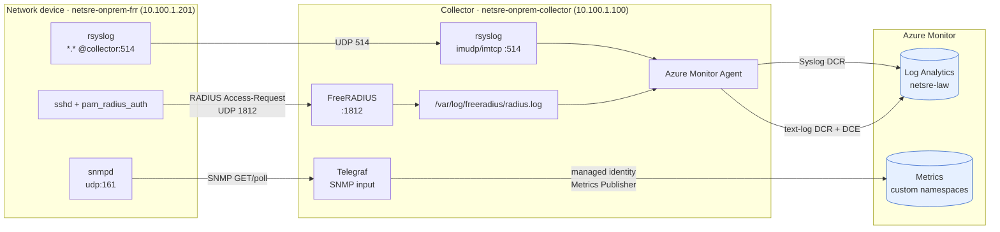
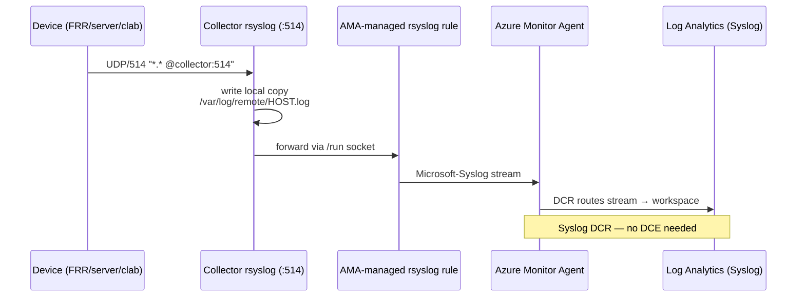
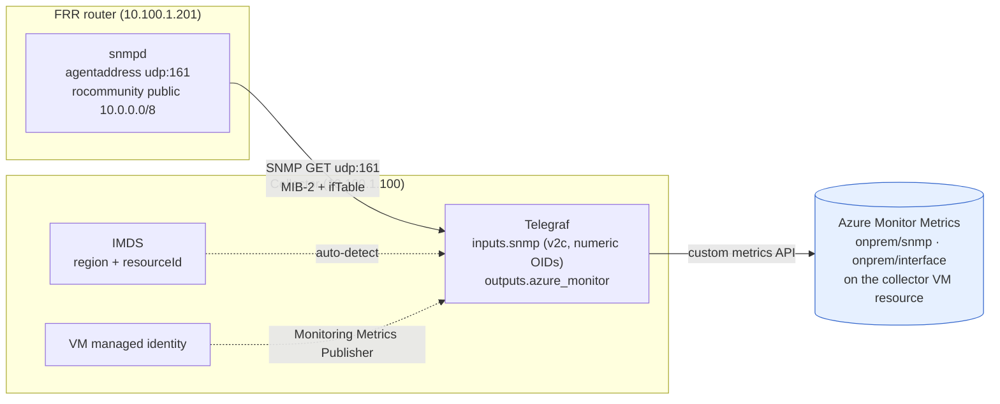
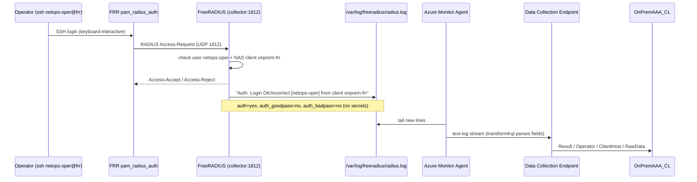
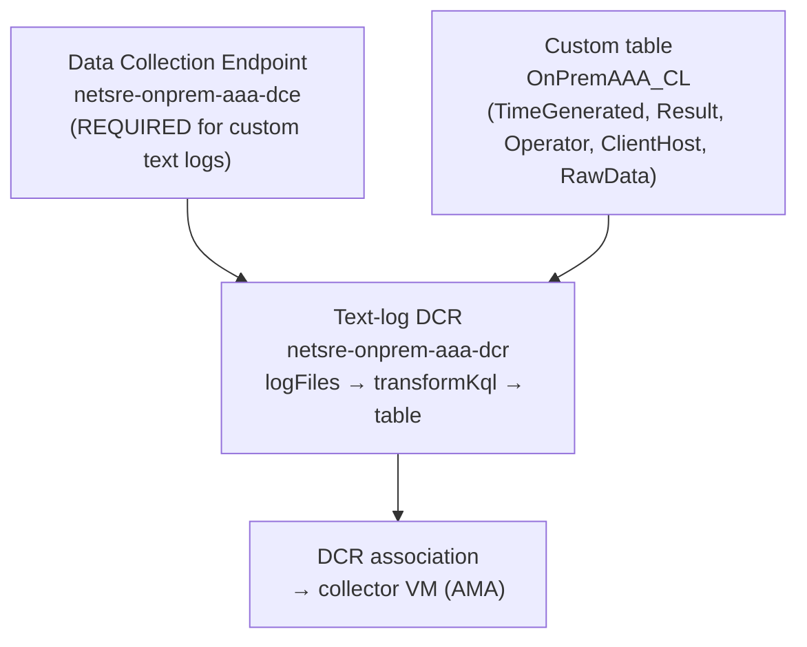
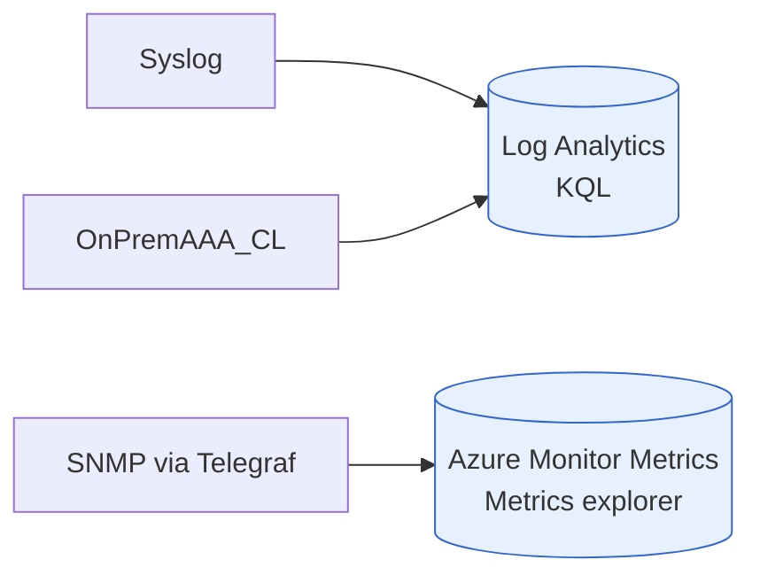
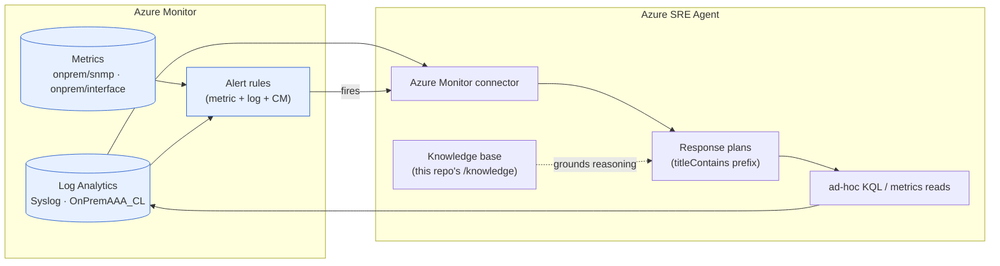
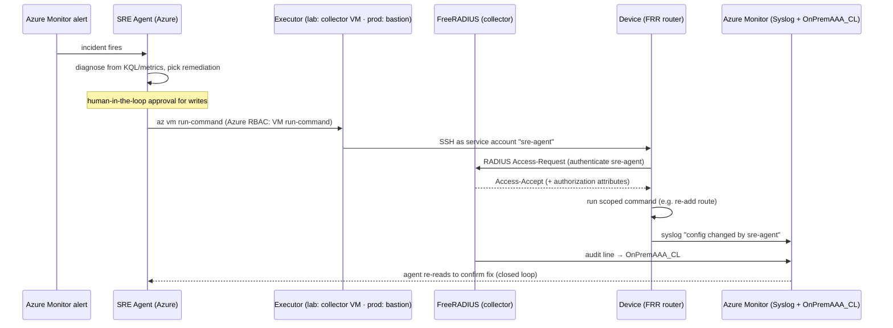
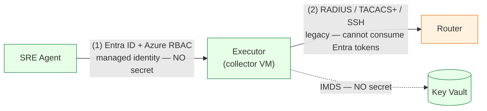

# On-Prem Telemetry Pipelines — How It Works

This document explains, end to end, how telemetry from the simulated on-prem
network devices reaches Azure Monitor. It covers the **three concrete pipelines**
that are implemented in this repository:

| # | Pipeline | Source | Transport | Azure destination |
|---|----------|--------|-----------|-------------------|
| 1 | **Syslog** | any device (`rsyslog`) | UDP/514 → collector → AMA | **Logs** — `Syslog` table |
| 2 | **SNMP metrics** | FRR router (`snmpd`) | Telegraf SNMP poll → managed identity | **Metrics** — custom namespaces on the VM |
| 3 | **RADIUS AAA audit** | FRR router (`pam_radius`) | RADIUS → FreeRADIUS log → AMA text log | **Logs** — `OnPremAAA_CL` table |

The **collector VM** (`<prefix>-onprem-collector`, static IP `10.100.1.100`) is the
hub for all three: it runs `rsyslog`, `snmpd`, **Telegraf**, **FreeRADIUS**, and the
**Azure Monitor Agent (AMA)**. The **FRR router** (`<prefix>-onprem-frr`, `10.100.1.201`)
is the simulated "network device" that emits syslog, answers SNMP, and delegates
operator logins to RADIUS.

> This is the *implementation* companion to the design/decision doc
> [`onprem-network-simulation-and-telemetry.md`](./onprem-network-simulation-and-telemetry.md).
> If you want the "why we chose this" rationale and the alternatives we rejected,
> read that one; this doc is the "how the wires actually run".

---

## 0. The big picture



**Two destinations, and the distinction matters:**

- **Logs** (Syslog, AAA) land in the **Log Analytics workspace** and are queried
  with **KQL**. They flow through the **AMA + DCR** machinery.
- **Metrics** (SNMP) land in **Azure Monitor Metrics** as **custom metrics
  attached to the collector VM's resource ID**. They are charted/alerted in the
  Metrics explorer and never touch Log Analytics. They flow through **Telegraf +
  managed identity**, with **no DCR and no DCE**.

Keep that split in mind — it is the single most common source of confusion
("why isn't my SNMP data in KQL?").

---

## 1. Pipeline 1 — Syslog → Log Analytics

### What it does
Every device forwards **all** syslog facilities to the collector, where AMA reads
the local syslog stream and ships it to the `Syslog` table in `netsre-law`.

### Flow



### Device side (`infra/cloud-init/frr-router.yaml`)
The router forwards everything to the collector. The collector IP is injected by
`onprem-router.bicep` via the `COLLECTOR_IP_PLACEHOLDER` token:

```
# /etc/rsyslog.d/90-forward.conf
*.* @COLLECTOR_IP_PLACEHOLDER:514
```

(`@` = UDP; `@@` would be TCP. The on-prem server uses the identical pattern.)

### Collector side (`infra/cloud-init/collector.yaml`)
`rsyslog` listens on 514 (UDP **and** TCP) and keeps a local per-host copy for
troubleshooting:

```
# /etc/rsyslog.d/10-remote.conf
module(load="imudp")
input(type="imudp" port="514")
module(load="imtcp")
input(type="imtcp" port="514")
template(name="RemoteHost" type="string" string="/var/log/remote/%HOSTNAME%.log")
if ($fromhost-ip != "127.0.0.1") then {
  action(type="omfile" dynaFile="RemoteHost")
}
```

### Azure side (`infra/modules/onprem-collector.bicep`)
Three resources make this work:

1. **AMA extension** on the collector VM (`AzureMonitorLinuxAgent`). When it
   installs, it drops its own rsyslog config that forwards the local syslog stream
   into a socket AMA listens on — this is how the received device logs reach AMA.
2. **Syslog DCR** (`<prefix>-onprem-syslog-dcr`) — collects the built-in
   `Microsoft-Syslog` stream, all facilities and levels, routed to the workspace:

   ```
   dataSources.syslog: [{ streams:[Microsoft-Syslog], facilityNames:[*], logLevels:[*] }]
   destinations.logAnalytics: [{ workspaceResourceId: <netsre-law> }]
   dataFlows: [{ streams:[Microsoft-Syslog], destinations:[law] }]
   ```

3. **DCR association** (`...-syslog-dcra`) scoped to the collector VM, which is
   what actually binds the DCR to that machine's AMA.

> **No DCE here.** The built-in `Microsoft-Syslog` stream uses the legacy Log
> Analytics ingestion path, which does not require a Data Collection Endpoint.
> (Contrast with the AAA pipeline below, which *does*.)

### Verify

```kql
Syslog
| where TimeGenerated > ago(1h)
| summarize count() by Computer, ProcessName
| order by count_ desc
```

---

## 2. Pipeline 2 — SNMP → Azure Monitor **Metrics**

### What it does
Telegraf on the collector **polls** the FRR router's SNMP agent every 60 s and
publishes the results as **custom metrics on the collector VM's resource ID**,
using the VM's **managed identity**. No DCR, no DCE, no Log Analytics.

### Flow



### Device side (`infra/cloud-init/frr-router.yaml`)
`snmpd` must listen on **all** interfaces (not the package default of
localhost-only) so the collector can reach it:

```
# staged as /etc/snmp/snmpd.conf.onprem, installed in runcmd
agentaddress udp:161
rocommunity public 10.0.0.0/8
sysLocation onprem-frr
sysContact netops
sysServices 72
```

> ⚠️ **Overwrite, don't drop-in, for snmpd.** A drop-in `agentaddress udp:161`
> *concatenates* with the packaged default `agentaddress 127.0.0.1,[::1]` into a
> malformed endpoint and snmpd exits with "Error opening specified endpoint".
> We replace the whole file instead.

### Collector side (`infra/cloud-init/collector.yaml`)
Telegraf reads a **drop-in** under `/etc/telegraf/telegraf.d/` (loaded by the
packaged unit's `-config-directory`) so the package's own `telegraf.conf`
conffile stays pristine:

```toml
# /etc/telegraf/telegraf.d/onprem.conf
[[outputs.azure_monitor]]
  namespace_prefix = "onprem/"

[[inputs.snmp]]
  agents = ["udp://10.100.1.201:161"]
  version = 2
  community = "public"
  [[inputs.snmp.field]]
    name = "sysName"
    oid  = "1.3.6.1.2.1.1.5.0"
    is_tag = true
  [[inputs.snmp.field]]
    name = "sysUpTime"
    oid  = "1.3.6.1.2.1.1.3.0"
  [[inputs.snmp.table]]
    name = "interface"
    oid  = "1.3.6.1.2.1.2.2"
    [[inputs.snmp.table.field]]
      name = "ifDescr"
      oid  = "1.3.6.1.2.1.2.2.1.2"
      is_tag = true
    [[inputs.snmp.table.field]]
      name = "ifInOctets"
      oid  = "1.3.6.1.2.1.2.2.1.10"
    [[inputs.snmp.table.field]]
      name = "ifOutOctets"
      oid  = "1.3.6.1.2.1.2.2.1.16"
```

Notes:
- **Numeric OIDs** are used deliberately to avoid a MIB-file dependency on the box.
- `is_tag = true` fields become **metric dimensions** (`sysName`, `ifDescr`), which
  is how you tell devices/interfaces apart in the Metrics explorer.
- The `[[inputs.snmp.table]]` walks the standard `ifTable` (`1.3.6.1.2.1.2.2`).

### Azure side (`infra/modules/onprem-collector.bicep`)
The only Azure resource required is a **role assignment**: the collector VM's
managed identity gets **Monitoring Metrics Publisher** at the VM scope:

```
roleDefinitionId: Monitoring Metrics Publisher (3913510d-42f4-4e42-8a64-420c390055eb)
scope: collector VM
principalId: vm.identity.principalId
```

Telegraf's `azure_monitor` output then:
- auto-detects the **region** and **resource ID** from **IMDS**,
- authenticates with the **managed identity**, and
- writes to custom-metric namespaces **`onprem/snmp`** and **`onprem/interface`**
  attached to the collector VM's resource.

> **Why the collector VM and not the FRR router?** Custom metrics are emitted
> against the *emitter's* resource ID (the box running Telegraf). The polled
> device is distinguished by the `sysName` / `agent_host` **dimension**, not by a
> separate resource.

### Verify (Metrics explorer, not KQL)
Metrics explorer → scope = **collector VM** → namespace `onprem/interface` →
metric `ifInOctets` → split by `ifDescr`. Or via CLI:

```powershell
az monitor metrics list --resource <collector-vm-id> --namespace "onprem/interface" `
  --metric ifInOctets --dimension ifDescr
```

---

## 3. Pipeline 3 — RADIUS AAA audit → Log Analytics

### What it does
Operator SSH logins to the FRR router are authenticated against **FreeRADIUS** on
the collector. FreeRADIUS writes a **who-did-what audit line** (`Login OK` /
`Login incorrect`, *without passwords*) to a flat log, and AMA ships that log into
the custom **`OnPremAAA_CL`** table via a **text-log DCR** — which, unlike Syslog,
**requires a Data Collection Endpoint (DCE)**.

### Flow



### Device side — RADIUS **client** (`infra/cloud-init/frr-router.yaml`)
The router runs `libpam-radius-auth`, pointed at the collector. The shared secret
is injected by `onprem-router.bicep` via `RADIUS_SECRET_PLACEHOLDER`:

```
# /etc/pam_radius_auth.conf  (server  secret  timeout)
10.100.1.100 RADIUS_SECRET_PLACEHOLDER 3
```

Wiring `pam_radius` into SSH (from `runcmd`):
- `netops-oper` is created as a **local account with its password locked** — so
  the *only* way it can log in is via RADIUS.
- `pam_radius_auth.so` is inserted as the **first, `sufficient`** auth step in
  `/etc/pam.d/sshd` (RADIUS accepts → done; otherwise fall through to local PAM).
- `KbdInteractiveAuthentication yes` in `sshd_config` so SSH will prompt for the
  RADIUS password.

```
auth sufficient pam_radius_auth.so   # prepended to /etc/pam.d/sshd
```

### Collector side — RADIUS **server** (`infra/cloud-init/collector.yaml`)
FreeRADIUS config is **staged to non-conffile paths and copied in `runcmd`** (the
usual conffile-collision avoidance). It defines the NAS client and the operator:

```
# /etc/freeradius/3.0/clients.conf   (localhost + the FRR router as a NAS)
client onprem-frr {
  ipaddr = 10.100.1.201
  secret = RADIUS_SECRET_PLACEHOLDER
  nastype = other
  require_message_authenticator = no
}

# appended to /etc/freeradius/3.0/mods-config/files/authorize
netops-oper Cleartext-Password := "RADIUS_OPERPASS_PLACEHOLDER"
```

Audit logging is enabled **without recording passwords** (edited via `sed` in
`runcmd` on `radiusd.conf`):

```
log {
  auth = yes            # record authentication events
  auth_badpass = no     # do NOT log the (wrong) password
  auth_goodpass = no    # do NOT log the (correct) password
}
```

The resulting audit trail at `/var/log/freeradius/radius.log` looks like:

```
Wed Jul 29 15:39:17 2026 : Auth: (1) Login OK: [netops-oper] (from client onprem-frr port 4819)
Wed Jul 29 15:40:41 2026 : Auth: (4) Login incorrect (...): [netops-oper] (from client onprem-frr port 4908)
```

### Azure side (`infra/modules/onprem-aaa.bicep`)
Custom text logs need **more plumbing than Syslog** — four resources:



1. **DCE** (`<prefix>-onprem-aaa-dce`) — mandatory for the Logs Ingestion path
   that custom text logs use.
2. **Custom table** `OnPremAAA_CL` with the parsed schema
   (`Result`, `Operator`, `ClientHost`, `RawData`, plus `TimeGenerated`).
3. **Text-log DCR** — a `logFiles` data source (`filePatterns:
   /var/log/freeradius/radius.log`, `format: text`) feeding a raw
   `Custom-OnPremAAA_CL` stream `{ TimeGenerated, RawData }`, then a
   **`transformKql`** that keeps only auth lines and parses the columns:

   ```kql
   source
   | where RawData has "Login OK" or RawData has "Login incorrect"
   | extend Result = iff(RawData has "Login OK", "Success", "Failure")
   | parse RawData with * "[" Operator "]" *
   | parse RawData with * "from client " ClientHost " port" *
   | project TimeGenerated, Result, Operator, ClientHost, RawData
   ```

4. **DCR association** to the collector VM, so its AMA applies the rule.

> `TimeGenerated` is the **ingestion** time; the device's own clock is preserved
> inside `RawData` for cross-checking.

### Verify

```kql
OnPremAAA_CL
| where TimeGenerated > ago(24h)
| project TimeGenerated, Result, Operator, ClientHost
| order by TimeGenerated desc
```

> ⚠️ **First-ingestion gotcha:** AMA text-log DCRs begin tailing from lines
> **appended after** the DCR association is applied — **pre-existing lines are not
> backfilled**. When validating a new custom-log pipeline, generate fresh events
> *after* the DCR is associated, and allow a few minutes for the first rows.

---

## 4. Cross-cutting concepts

### 4.1 DCR vs DCE — when do you need a DCE?

| Ingestion path | Stream | DCE required? | Used by |
|----------------|--------|--------------|---------|
| Legacy LA agent streams | `Microsoft-Syslog`, perf counters | **No** | Pipeline 1 (Syslog) |
| Logs Ingestion API / custom text logs | `Custom-*_CL` | **Yes** | Pipeline 3 (AAA) |
| Custom metrics | — (not a DCR at all) | **No** | Pipeline 2 (SNMP) |

A **DCR** is the *routing/transform rule*; a **DCE** is the *regional ingestion
endpoint* that the newer Logs Ingestion path posts to. Syslog rides the older path
and skips the DCE; custom text logs cannot.

### 4.2 Logs vs Metrics — two different stores



- **Logs** = flexible, schema-on-read, queried with **KQL**, higher latency, richer.
- **Metrics** = pre-aggregated numeric time series, low latency, cheap, dimensioned,
  ideal for charts/alerts — but **not** in KQL.

If you later want SNMP data *queryable in KQL alongside syslog*, the alternative is
to point Telegraf at the **Logs Ingestion API** (a `*_CL` table via a DCR+DCE)
instead of `outputs.azure_monitor`. We chose metrics because that is the natural
home for counters like `ifInOctets`.

### 4.3 The cloud-init conffile-collision trap (affects all three)

`cloud-init` `write_files` runs **before** the `apt` package install. If you
pre-write a file that the package ships as a **conffile** (`/etc/snmp/snmpd.conf`,
`/etc/telegraf/telegraf.conf`, FreeRADIUS `clients.conf`, `/etc/pam_radius_auth.conf`),
the install hits a conffile conflict, **half-configures**, and the service silently
keeps its default (or the package user like `_telegraf` is never created).

**Two safe patterns, both used here:**
- **Stage-then-copy:** write to a non-conffile path (e.g. `snmpd.conf.onprem`,
  `clients.onprem.conf`) and `install`/`cp` it into place in `runcmd` *after* the
  package is installed.
- **Drop-in dir:** write into a directory the unit already loads
  (`/etc/telegraf/telegraf.d/`) so the package conffile is untouched.

### 4.4 Secrets & parameterization

The RADIUS shared secret and operator password are **`@secure()` Bicep params**
(`radiusSharedSecret`, `radiusOperatorPassword`), substituted into the cloud-init
via `replace()` (the same mechanism as `COLLECTOR_IP_PLACEHOLDER`). Defaults live
in `deploy-onprem.ps1` (mirroring the `vpnSharedKey` pattern). For production these
belong in **Key Vault**, not script defaults.

### 4.5 Alerting on the telemetry (turning signals into incidents)

The pipelines above only *land* data; alerts make it actionable and give the SRE
Agent an incident to attach a response plan to. Two Bicep modules define them:

**`infra/modules/onprem-log-alerts.bicep`** — an action group `${prefix}-onprem-ag`
plus rules over the ingested data (deployed by the `telemetry` stage):

| Alert | Type | Signal | Sev |
|-------|------|--------|-----|
| `${prefix}-onprem-syslog-critical` | scheduled query | `Syslog` `daemon` facility, severity `critical/alert/emergency` | 2 |
| `${prefix}-onprem-aaa-auth-failures` | scheduled query | `OnPremAAA_CL` where `Result == "Failure"` | 2 |
| `${prefix}-onprem-collector-heartbeat-missing` | scheduled query | `Heartbeat` gap for `Computer == onprem-collector` | 1 |
| `${prefix}-onprem-snmp-uptime-reset` | metric alert | `onprem/snmp` `sysUpTime` drop (device reboot) | 3 |

> Schema gotchas baked into the queries: FRR syslog is the **`daemon`** facility
> with severity strings `error/critical/alert/emergency` (it is `error`, *not*
> `err`); `OnPremAAA_CL` columns have **no `_s` suffix** (`Result`, `Operator`,
> `ClientHost`, `RawData`); Heartbeat only exists for `onprem-collector` (AMA is
> only installed there); `onprem/snmp` has `sysUpTime` but there is **no
> `ifOperStatus`** custom metric.

**`infra/modules/onprem-alerts.bicep`** — metric alerts on a **Connection Monitor**
(`ChecksFailedPercent` / `TestResult`). It is parameterized with a `monitorLabel`
so it can be deployed once per CM without name collisions:

| `monitorLabel` | Targets CM | Produces |
|----------------|-----------|----------|
| `onprem` (default) | `netsre-onprem-connection-monitor` | `${prefix}-onprem-cm-checks-failed` (sev2), `${prefix}-onprem-cm-test-result-fail` (sev1) |
| `clab` | `netsre-clab-connection-monitor` | `${prefix}-clab-cm-checks-failed` (sev2), `${prefix}-clab-cm-test-result-fail` (sev1) |

The `clab` variant is what turns a **containerlab control-plane fault** (a broken
`onprem-r1 ↔ onprem-r2` eBGP session) into a fired Azure alert — see §4.6.

### 4.6 Containerlab traversal Connection Monitor (T3)

`infra/modules/onprem-clab-connection-monitor.bicep` makes control-plane faults
*inside* the containerlab fabric observable from Azure. The clab host VM runs the
**Network Watcher agent** (extension added in `onprem-containerlab.bicep`) and
probes the in-fabric server `172.31.20.10` (ICMP + HTTP:80). The probe path is
`host → onprem-r1 → eBGP → onprem-r2 → server`, and the **return path is also
BGP-dependent** (r1 advertises the host-facing `172.31.11.0/30` into BGP), so
breaking r1↔r2 BGP fails the probe both ways and raises the `clab` CM alerts.
See `infra/containerlab/README.md` → *Relationship to the Azure data path (T3)*
for the veth/route wiring and the baked-cloud-init caveat.

---

## 5. File map

| Concern | File |
|---------|------|
| Device syslog forward + snmpd + PAM RADIUS | `infra/cloud-init/frr-router.yaml` |
| Collector rsyslog + Telegraf + FreeRADIUS | `infra/cloud-init/collector.yaml` |
| Collector VM + AMA + Syslog DCR + Metrics Publisher role | `infra/modules/onprem-collector.bicep` |
| FRR router VM + RADIUS secret param | `infra/modules/onprem-router.bicep` |
| AAA DCE + `OnPremAAA_CL` table + text-log DCR | `infra/modules/onprem-aaa.bicep` |
| Log/metric alerts (syslog, AAA, heartbeat, SNMP) + action group | `infra/modules/onprem-log-alerts.bicep` |
| Connection Monitor metric alerts (parameterized by `monitorLabel`) | `infra/modules/onprem-alerts.bicep` |
| Containerlab-traversal Connection Monitor (T3) | `infra/modules/onprem-clab-connection-monitor.bicep` |
| Containerlab host VM + Network Watcher agent extension | `infra/modules/onprem-containerlab.bicep` |
| Deploy orchestration (`telemetry` / `device` / `aaa` / `containerlab` stages) | `scripts/deploy-onprem.ps1` |

---

## 6. End-to-end deploy & verify

```powershell
# Deploys collector (telemetry), FRR router + LAN + CM (device), and AAA pipeline.
.\scripts\deploy-onprem.ps1 -Stage all

# Generate an audit event, then confirm the AAA pipeline:
#   ssh netops-oper@10.100.1.201   (or: pamtester sshd netops-oper authenticate)
```

Verification queries / views:

| Pipeline | Where | Query |
|----------|-------|-------|
| Syslog | `netsre-law` | `Syslog \| where TimeGenerated > ago(1h)` |
| SNMP | Metrics explorer | scope = collector VM, namespace `onprem/interface` |
| AAA | `netsre-law` | `OnPremAAA_CL \| where TimeGenerated > ago(24h)` |

---

## 7. How the SRE Agent *consumes* this telemetry

Everything above lands in two Azure Monitor stores. The **Azure SRE Agent** reads
from both — it never talks to the on-prem devices to *observe* them; it only ever
reads Azure Monitor. That indirection is the whole point: the collector +
AMA/Telegraf pipelines are what turn legacy, on-box protocols (syslog, SNMP,
RADIUS) into cloud-queryable signals the agent already knows how to use.



**Access model (read path):**

- **Identity & RBAC.** The agent's **managed identity** holds **Reader** (and
  effectively *Monitoring Reader*) on the lab resource group, which is what lets
  it query the workspace and read metrics. (It also holds **Network Contributor**
  for Azure-side remediation — see §8.)
- **Alerts are the trigger, not polling.** The agent does not poll dashboards. The
  `onprem-alerts.bicep` / connection-monitor alerts fire on a metric/log/CM
  threshold; the **Azure Monitor connector** delivers the alert to the agent,
  which opens an incident and selects a **response plan** by alert-name prefix
  (`<prefix>-cm-checks-failed`, `titleContains`).
- **Enrichment via KQL.** Once triggered, the agent runs **KQL against
  `netsre-law`** to pull the relevant `Syslog`, `OnPremAAA_CL`, and Connection
  Monitor rows around the incident window, and reads the SNMP **metrics** for the
  affected interfaces — correlating data-plane symptoms with control-plane events.
- **Grounding.** The `/knowledge` markdown and the custom agents/skills in
  `sre-agent-config/` tell it *what these tables mean* (e.g. that
  `OnPremAAA_CL.Result == "Failure"` spikes may indicate a misconfigured NAS or a
  brute-force attempt, that `ifInOctets` flatlining on the FRR uplink implies a
  dead data path).

**What the agent can already answer from telemetry alone:**

| Question | Signal it reads |
|----------|-----------------|
| "Is the on-prem router forwarding?" | SNMP `ifInOctets/ifOutOctets` trend + CM probe result |
| "Did someone change the device recently?" | `Syslog` (FRR/config) + `OnPremAAA_CL` login trail |
| "Who logged into the router before the outage?" | `OnPremAAA_CL` (`Operator`, `ClientHost`, `Result`, time) |
| "Is auth itself failing?" | `OnPremAAA_CL` `Result == "Failure"` rate |

> In this tenant the SRE Agent *resource* can't be provisioned (the tenant is not
> allow-listed to create agent identities), so this read path is validated by
> running the **same KQL/metrics queries** a response plan would — the queries in
> §6 are exactly what the agent would issue.

---

## 8. Closing the loop — how the SRE Agent *runs commands* on legacy devices

Reading telemetry is only half of SRE. To **remediate**, the agent must execute a
change *on the device*. For Azure-native faults it just uses its **Network
Contributor** identity (fix an NSG, repair a UDR, reset a VPN connection). But a
**legacy on-prem device has no Azure control plane** — you cannot `az` your way
into a router's config. The agent needs an **execution path with network
line-of-sight** to the device, and the device must **authenticate and authorize**
whoever shows up. That is where RADIUS **authentication (+ authorization)** — not
just the accounting/audit trail of §3 — becomes necessary.

> **What is the "executor"?** *Executor* is this document's term (**not** an Azure
> product concept) for **the compute inside the on-prem network that performs the
> device-native login/command on the agent's behalf.** The SRE Agent does **not**
> SSH into the router itself: it is a **cloud-managed service with no route** into
> the private RFC1918 LAN, and its action surface is **Azure control-plane
> operations** (ARM calls + connectors, gated by RBAC and approval), *not* a
> general SSH client holding device credentials. So it triggers an Azure action it
> *is* allowed to make (e.g. `az vm run-command`), which lands execution on the
> in-network executor, and **that box** does the SSH → PAM → RADIUS login. Who
> plays "executor" differs by environment (see the split below).

**Keep two contexts separate — this section is split accordingly.** What is fine
for the lab (basic authN/authZ on a container/VM box) is *not* what you would run
against real hardware under stringent security requirements:

| Concern | 🧪 Lab (this repo) | 🏭 Production (hardware, stringent security) |
|---------|--------------------|----------------------------------------------|
| Device | FRR on a Linux VM / Containerlab | vendor NOS (Cisco / Juniper / Nokia / Arista) |
| **Executor** | the **collector VM** (reuses the monitoring box) | a **dedicated hardened bastion / PAM jump server** — *never* the monitoring box (separation of duties) |
| Agent → executor | `az vm run-command` | Automation Hybrid Worker / Function / privileged-access workflow, with approval |
| AuthN | `pam_radius` → FreeRADIUS (single box) | RADIUS/TACACS+ to a **hardened, HA AAA cluster** |
| AuthZ | coarse (login = shell) | **TACACS+ per-command** authorization |
| Accounting | FreeRADIUS auth log → `OnPremAAA_CL` | RADIUS Accounting (1813) + TACACS+ command accounting → **SIEM** |
| Secrets | script-default shared secret; static `netops-oper` | Key Vault / HSM; **JIT short-lived** creds; **RadSec** certs (§8.4) |
| Approval | optional (demo the gate) | **mandatory human-in-the-loop** for every write |

The subsections below give the **lab wiring first**, then the **production
hardening** for each concern.

### 8.1 AAA, precisely — and what we have vs. what actuation needs

| AAA leg | Question | Protocol packet | Implemented today? | Needed for actuation? |
|---------|----------|-----------------|--------------------|-----------------------|
| **Authentication** | "Are you who you say?" | RADIUS Access-Request/Accept | ✅ yes — `pam_radius` on the FRR router authenticates logins against FreeRADIUS | ✅ the agent's executor must authenticate the same way |
| **Authorization** | "Are you allowed to run *this*?" | RADIUS VSAs / privilege-level, or **TACACS+** per-command | ⚠️ coarse only (login = full shell) | ✅ needed to scope the agent to safe commands |
| **Accounting** | "What did you do?" | RADIUS Accounting (1813) / audit log | ✅ audit trail via FreeRADIUS auth log → `OnPremAAA_CL` | ✅ every agent action must be recorded |

So §3 gave us **authentication + an audit trail**. Actuation additionally needs a
**dedicated machine identity** for the agent and **command authorization**.

### 8.2 The execution path — an in-VNet executor (jump host)

The SRE Agent runs in Azure and has no direct route into the on-prem LAN, so it
invokes an **executor that already lives in the on-prem VNet**. **In the lab** the
**collector VM is the natural choice** (it has line-of-sight to every device and
already holds the AAA relationship). **In production, use a dedicated hardened
bastion / PAM jump server instead — never the monitoring collector** — so that
privileged device access is isolated from telemetry collection (separation of
duties). Either way the agent reaches the executor via an **Azure control-plane
action** it *is* allowed to make (`az vm run-command` in the lab; an Automation
runbook / Function on a Hybrid Worker in production), and the executor performs the
device-native change (SSH / NETCONF / gNMI / vendor API).



Why this shape:

- **No inbound to Azure, no new exposure.** The device never needs a public
  endpoint; the executor initiates outbound-style SSH from inside the VNet.
- **Azure RBAC gates the trigger.** Granting the agent identity **only** the
  `Microsoft.Compute/virtualMachines/runCommand/action` (a tightly-scoped custom
  role on the executor VM) means the agent can *ask the executor to act* but cannot
  freely reconfigure Azure.
- **RADIUS gates the device.** Even with run-command, the executor still has to
  **authenticate to the device as a real RADIUS principal** — so the device (not
  Azure) remains the authority on who may log in, and every action is attributed
  to `sre-agent`, not to a shared root.
- **The loop closes in telemetry.** The change emits syslog + a RADIUS audit line,
  which flow back through §1/§3, so the agent can **verify its own remediation**
  and the audit trail shows an autonomous actor did it.

### 8.3 Implementing actuation — lab path vs. production hardening

None of this is deployed yet. Each step lists the **🧪 lab** implementation (the
minimum to prove the path on FRR) and the **🏭 production** hardening for real
hardware under stringent security requirements.

1. **Agent service account.**
   - 🧪 *Lab:* add an `sre-agent` principal to FreeRADIUS
     (`mods-config/files/authorize`), distinct from the human `netops-oper` so its
     actions are attributable and independently revocable. Enable **RADIUS
     Accounting** (port **1813**, `Acct-Start/Stop`) alongside the auth log for a
     formal session record.
   - 🏭 *Prod:* the account lives in a **hardened, HA AAA cluster**; its credential
     is **JIT / short-lived from Key Vault or an HSM** (see §8.4), never a static
     password; accounting streams to a **SIEM**, not only Log Analytics.

2. **Authorization scoping.**
   - 🧪 *Lab:* RADIUS gives only coarse authorization, so constrain `sre-agent` with
     a **restricted shell** (`rbash` / forced-command / `sudo` allow-list) on the
     device — login still equals "a shell", but only a fixed command set runs.
   - 🏭 *Prod:* use **TACACS+** (modelled with `tac_plus` in the lab) for true
     **per-command authorization + command accounting** — the industry norm for
     Cisco / Juniper / Nokia. RADIUS authenticates; TACACS+ answers "may
     `sre-agent` run *this exact command*?".

3. **Execution trigger & blast radius.**
   - 🧪 *Lab:* a custom Azure role on the collector VM granting the agent identity
     *only* `Microsoft.Compute/virtualMachines/runCommand/action`, plus a hardened
     remediation script that SSHes as `sre-agent` and accepts only a **whitelisted
     set of parameterized fixes**.
   - 🏭 *Prod:* a **dedicated bastion / PAM jump server** (not the monitoring
     collector), reached via an **Automation Hybrid Worker / Function**; the
     allow-listed fixes are versioned, code-reviewed, and signed.

4. **Human-in-the-loop.**
   - 🧪 *Lab:* optional — useful to demonstrate the gated-action flow.
   - 🏭 *Prod:* **mandatory approval** on any state-mutating command; observation and
     diagnosis stay autonomous. The SRE Agent supports gated actions in response
     plans.

> **When to graduate to a vendor NOS.** FRR authenticates via Linux PAM, so it
> proves the *authentication + execution* path faithfully, but it has no native
> concept of privilege levels or per-command TACACS+ authorization. To exercise
> **real command authorization/accounting** (`aaa authorization commands`,
> `aaa accounting commands`), swap the FRR box for a vendor NOS (Nokia SR Linux,
> Arista cEOS, Cisco) in the Containerlab fabric — the RADIUS/TACACS+ server and
> the executor pattern stay exactly the same.

### 8.4 Identity & credential model — managed identity / WIF vs. long-lived secrets

A natural question: can the `sre-agent` service account use **Azure managed
identity + Workload Identity Federation (WIF)** instead of long-lived secrets? The
answer hinges on recognising **two distinct authentication boundaries** — managed
identity/WIF cleanly solves one but **cannot natively cross the other**.



**Boundary 1 — Agent → Executor (Azure control plane): secretless.**
`az vm run-command` is authenticated by Entra + Azure RBAC; the executor reads any
secrets it needs from **Key Vault using its own managed identity via IMDS**. No
stored secret on either leg.

**Boundary 2 — Executor → device (device plane): cannot use Entra tokens.**
RADIUS (RFC 2865) and TACACS+ predate OAuth/OIDC. There is **no standard way for a
device to accept an Entra JWT as a credential** (no "EAP-OAuth", no token
introspection). So you cannot federate a managed identity *directly* into a
router login.

**Where WIF actually fits:**
- **Executor in Azure (our collector VM):** WIF adds nothing — the VM already has a
  native managed identity via IMDS. Use it directly.
- **Executor on *real* on-prem hardware (no Azure MI):** *this* is WIF's use case —
  federate an on-prem OIDC IdP / k8s SA → Entra so the off-Azure box gets Entra
  tokens **without a stored client secret**. But that token still only helps it
  reach *Azure* (e.g. Key Vault) — it still can't be handed to the router as a
  RADIUS credential.

**What's irreducible vs. what can be ephemeral:**

| Secret | Non-long-lived? |
|--------|-----------------|
| Agent → executor (Azure) | ✅ Managed identity, no secret |
| Executor → Key Vault | ✅ Managed identity, no secret |
| **`sre-agent` user credential** (presented at device login) | ✅ **JIT / short-lived** (below) |
| **NAS ↔ RADIUS-server shared secret** | ⚠️ Long-lived by protocol — rotate, or replace with **RadSec (RADIUS/TLS)** certs |

**The user credential does not have to be a static password.** Preferred pattern:
1. Executor uses its **managed identity** to fetch a **just-in-time, short-lived
   credential** from Key Vault (or mint an OTP), scoped to one remediation session.
2. It presents that as the RADIUS "password" over the SSH keyboard-interactive →
   PAM → RADIUS chain.
3. FreeRADIUS validates it — via **`rlm_rest`** calling a Key Vault / REST backend
   in its `authenticate` section, or as a pre-provisioned OTP.

This shrinks the long-lived surface to **(a)** Key Vault access — itself governed
by the secretless managed identity — and **(b)** the NAS↔server trust anchor.

**The one thing you can't eliminate with legacy gear** is the **device↔AAA-server
trust**. TACACS+ is *worse* here (its entire body is obfuscated with an MD5 scheme
keyed on the shared secret). Two realistic options:
- **Rotate** a Key Vault-sourced shared secret (simple; sufficient for the lab).
- **RadSec (RADIUS over TLS, RFC 6614)** — replaces the shared secret with
  **mutual-TLS certificates** that can be short-lived and PKI-managed/revocable.
  Modern NOSes (Nokia SR Linux, Arista, newer Cisco) support it; FRR-via-PAM does
  not.

**Bottom line:** a *fully* secretless design is **not achievable with legacy
devices**, because device firmware only speaks RADIUS/TACACS+/SSH and can't
validate Entra tokens. The best achievable posture is: **managed identity for both
Azure legs** (secretless) + a **JIT short-lived user credential** from Key Vault
(not a static password) + the **NAS trust anchor hardened via rotation or RadSec
certificates**. WIF is relevant *only* if the executor/RADIUS server runs off-Azure.

---

*Companion docs:*
[On-prem simulation & telemetry (design/decisions)](./onprem-network-simulation-and-telemetry.md)
· [Containerlab on-prem — how it works](./containerlab-onprem-how-it-works.md)
