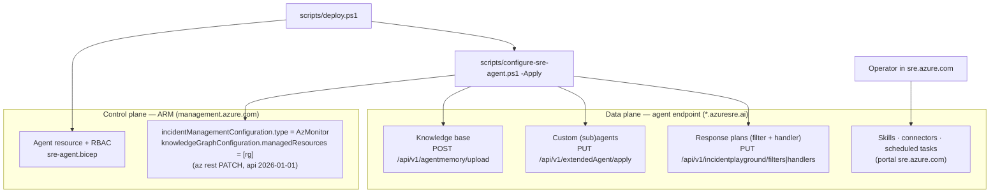
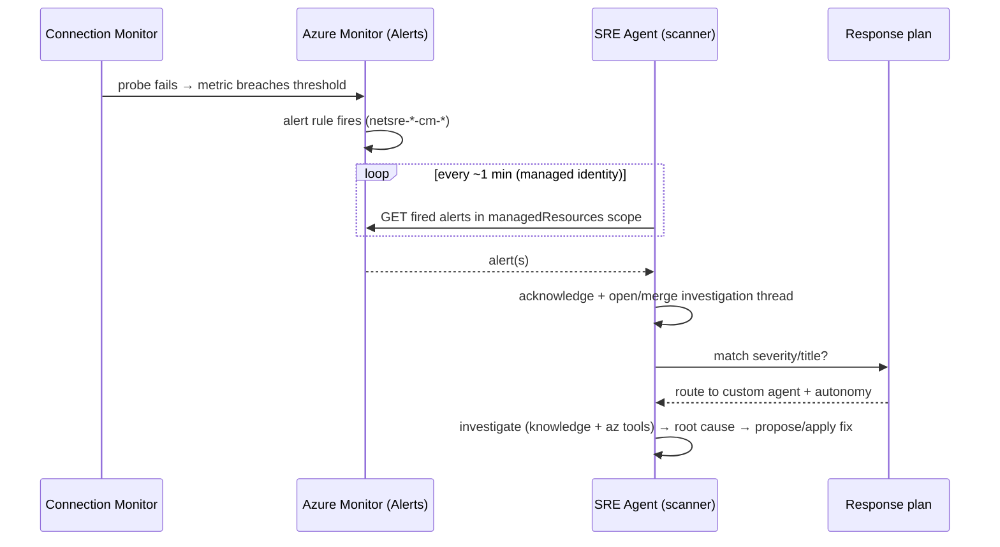

# Azure SRE Agent Configuration — How It Works

> **📍 Part A — Azure Networking SRE** (shared agent plumbing, also used by Part B). See the [docs hub](./README.md).


This document explains what it takes to turn the deployed Azure SRE Agent
**resource** into a **working agent** that closes the incident loop:

> **detect → investigate → identify root cause → (ideally) fix**

It covers the two configuration planes, exactly which pieces are applied
programmatically vs. in the portal, how incident **detection** actually works, the
API surface we use, and how to verify readiness.

> Companion docs: [`onprem-telemetry-pipelines-how-it-works.md`](./onprem-telemetry-pipelines-how-it-works.md)
> (how telemetry reaches Azure Monitor) and the runbooks in [`../knowledge/`](../knowledge)
> (what the agent reads to troubleshoot).

---

## 0. TL;DR

| Question | Answer |
|----------|--------|
| Is deploying `sre-agent.bicep` enough? | **No.** The Bicep deploys only the agent *resource* + RBAC. Behaviour (incident platform, knowledge, response plans) is configured afterwards. |
| How does the agent get alerts? | It **polls the Azure Monitor Alerts API every ~1 min** with its managed identity. No action group points at it. |
| What's applied automatically by `deploy.ps1`? | Azure Monitor incident integration, knowledge-graph scope, the knowledge base, the **custom (sub)agents**, and the **incident response plans** (all via `configure-sre-agent.ps1 -Apply`). |
| What still needs the portal? | Only optional extras: **skills**, **connectors** (data sources), and **scheduled tasks**. The closed loop no longer requires a manual portal step. |
| How do I check what's done? | `.\scripts\configure-sre-agent.ps1` prints a **Working-agent readiness** report. |

---

## 1. The two configuration planes

The SRE Agent's configuration is split across two planes. Almost all of it is now
programmatic; only a few optional objects (skills, connectors, scheduled tasks) remain
portal-only.



### Control plane — ARM, GA API `2026-01-01`
Set with `az rest` PATCH against the agent resource:

- `incidentManagementConfiguration.type = AzMonitor` — connects Azure Monitor as the
  incident source. **No credentials needed**: alerts flow in via the agent's managed
  identity. (Other values: `PagerDuty`, `ServiceNow`, `None`.)
- `knowledgeGraphConfiguration.managedResources = [ <resource group id> ]` — scopes
  which resources the agent reasons over (and where it looks for alerts). The
  knowledge-graph UAMI (`identity`) is preserved.

### Data plane — agent endpoint `https://<name>.<region>.azuresre.ai`
Token audience **`https://azuresre.dev`** (`az account get-access-token --resource https://azuresre.dev`):

- **Knowledge upload:** `POST /api/v1/agentmemory/upload` — `multipart/form-data`, form
  field name **`files`** (plural, repeatable; ≤16 MB/file, ≤100 MB total).
- **Status:** `GET /api/v1/agentmemory/status` and `GET /api/v1/agentmemory/indexer-status`
  (reports `documentsProcessed` / `documentsFailed`).
- **Custom (sub)agents:** `PUT /api/v1/extendedAgent/apply` — body is an
  `AgentConfiguration` YAML document (`Content-Type: application/x-yaml`) with the
  sub-agent's `name`, `system_prompt`, `handoff_description`, `agent_type` and built-in
  `tools`. Returns HTTP 202. List: `GET /api/v1/extendedAgent/agents`.
- **Incident response plans** = an incident **filter** + a custom-agent **handler**:
  - `PUT /api/v1/incidentplayground/filters/{id}` — which incidents to catch
    (`priorities` array — empty = all; `titleContains`; **`titleNotContains` must be an
    array**; `agentMode`; `handlingAgent` = a sub-agent name; `mergeEnabled` /
    `mergeWindowHours`). Do **not** send an `incidentPlatform` property — it is derived.
  - `PUT /api/v1/incidentplayground/handlers/{id}` — what to do (`incidentFilterId`,
    `incidentProcessingGuide`). `PUT` creates, `POST` updates an existing object.
  - List: `GET /api/v2/incidentManagement/incidentFilters` and
    `GET /api/v2/extendedAgent/incidentHandlers`.

> **Data-plane gotchas** (all handled by `configure-sre-agent.ps1`): every request must send
> `Accept: application/json` (or the SPA static handler answers with HTML); JSON bodies must
> be written **without a UTF-8 BOM** (a BOM mis-routes the request to the static handler →
> HTTP 405); and `titleNotContains` must be a JSON **array** (`[]`), not a string — an empty
> string also surfaces as a 405.

### Portal only (`sre.azure.com`)
**Skills**, **connectors** (data sources) and **scheduled tasks** do not yet have a stable
programmatic envelope here and are created in the portal. (The ARM `subagents` sub-resource
is separately gated to internal tenants — *"Agent Extensions are not available for this
tenant"* — but the data-plane `extendedAgent/apply` path above sidesteps it for sub-agents.)

---

## 2. What makes a "working" agent

All of the following must hold for a full detect → investigate → root-cause → fix loop.
`configure-sre-agent.ps1` verifies the automatable ones in its **Working-agent readiness**
section.

| Stage | Requirement | Where / how | Automated? |
|-------|-------------|-------------|------------|
| **Detect** | Incident platform = Azure Monitor | `incidentManagementConfiguration.type=AzMonitor` | ✅ `configure-sre-agent.ps1 -Apply` |
| **Detect** | Managed identity has **Monitoring Contributor on the SUBSCRIPTION** | `modules/sre-agent-sub-roles.bicep` | ✅ bicep |
| **Detect** | Alert rules that actually fire | `modules/alerts.bicep` (metric alerts on Connection Monitors) | ✅ bicep |
| **Detect** | Agent scoped to the resources | `knowledgeGraphConfiguration.managedResources=[<rg>]` | ✅ script / bicep |
| **Investigate** | Read telemetry (logs / metrics) | Reader + Log Analytics Reader + Monitoring Reader on RG | ✅ bicep |
| **Investigate** | Run diagnostics (`az`, `az vm run-command`) | Contributor (`accessLevel=High`) | ✅ bicep |
| **Investigate** | Domain context | Knowledge base (18 files) | ✅ `-Apply` (agentmemory) |
| **Root-cause** | Route incident to the right expert | **Incident response plan** (filter + handler → sub-agent) | ✅ `configure-sre-agent.ps1 -Apply` |
| **Fix** | Write access | Contributor + Network Contributor | ✅ bicep |
| **Fix** | Autonomy | `mode=Review` (propose + approve) or `Autonomous` (hands-off) — `sreAgentMode` param | ✅ bicep param |

**The full loop is now applied programmatically** by `configure-sre-agent.ps1 -Apply`,
including the custom (sub)agents and the incident response plans. Without at least one
response plan the agent still detects incidents and opens threads, but won't route them to a
custom agent or act — so applying the plans is what actually closes the loop.

---

## 3. How detection actually works

The agent does **not** rely on an action group being pointed at it. Instead, a scanner
**polls the Azure Monitor Alerts Management API** on a schedule and turns fired alerts into
investigation threads.



Scanner facts (from the [Azure Monitor alerts docs](https://learn.microsoft.com/azure/sre-agent/azure-monitor-alerts)):

| Setting | Value |
|---------|-------|
| Scan interval | 1 minute |
| Alerts per API call | 250 |
| Initial scan lookback | 1 day |
| Merge lookback (dedupe repeated firings) | 7 days |
| Status sync interval | 5 minutes |

If alerts never appear, the docs say to check exactly three things — all satisfied in this
repo and verified by the readiness script:

1. The identity has **Monitoring Contributor on the subscription**
   (`modules/sre-agent-sub-roles.bicep`).
2. Azure Monitor **alert rules exist** for the scoped resources (`modules/alerts.bicep`).
3. The alert rules **actually fired**.

> The action group in `alerts.bicep` (`<prefix>-netops-ag`) only sends operator **email** —
> it is not how the agent receives incidents.

---

## 4. Applying the configuration

### Automatically, during deployment
`deploy.ps1` runs the configurator post-deploy (when `-DeploySreAgent`, non-fatal on error):

```powershell
# inside deploy.ps1, after the infra deployment:
.\scripts\configure-sre-agent.ps1 -AgentName "$Prefix-sre-agent" -ResourceGroup $ResourceGroup -Apply
```

### Manually / to re-check
```powershell
# Report only (read-only): validate manifest + print Working-agent readiness
.\scripts\configure-sre-agent.ps1

# Apply: PATCH AzMonitor + scope, upload + index the knowledge base
.\scripts\configure-sre-agent.ps1 -Apply
```

The script reads the declarative manifest [`sre-agent-config/config.yaml`](../sre-agent-config/config.yaml)
(agent name/RG, the 18 `knowledge:` files, custom agents, skills, response plans, scheduled
tasks). It requires **Python + PyYAML** to parse the manifest.

### What `-Apply` configures for you
- Control plane: `incidentManagementConfiguration.type=AzMonitor` + knowledge-graph scope.
- Data plane: uploads + indexes the knowledge base, applies the **custom (sub)agents**
  (`network-expert`, `connectivity-triage`), and creates the **incident response plans**
  (`connectivity-failure` → Sev1/Sev2, `onprem-fabric-clab` → clab CM failures,
  `onprem-fabric-syslog` → on-prem device syslog/telemetry alerts, `latency-degradation` →
  Sev4), each as a filter + handler routed to a sub-agent. The on-prem plans carry a
  multi-step `processingGuide` mirroring the `onprem-fabric-triage` skill. Re-runs are
  idempotent (`PUT` create → `POST` update).

### Optional portal steps
These improve investigation quality but are not required for the loop: add **skills**, add
**connectors** (data sources such as Azure Monitor logs), and define **scheduled tasks**.
For hands-off remediation, deploy with `-sreAgentMode Autonomous` (default is `Review` =
propose + wait for approval). Docs:
<https://learn.microsoft.com/azure/sre-agent/incident-response-plans>.

---

## 5. Known caveats

- **Portal "incident platform" panel may show "not connected"** even though
  `incidentManagementConfiguration.type=AzMonitor` is set and confirmed via ARM GET. The
  portal appears to wire additional data-plane state when you click **Connect**. Alert
  scanning via `managedResources` still works; complete the portal Connect step if the
  panel matters to you.
- **Custom (sub)agents and response plans are now automated** via the agent data plane
  (`extendedAgent/apply` + `incidentplayground/filters|handlers`). Watch the data-plane
  gotchas: send `Accept: application/json`, write JSON without a BOM, and pass
  `titleNotContains` as an array — all handled by `configure-sre-agent.ps1`. **Skills,
  connectors and scheduled tasks** remain portal-only for now.
- **Transient 405s during an agent upgrade:** while the agent is mid-upgrade the ingress may
  briefly return HTTP 405 for `PUT` on the data-plane paths. Re-run `-Apply` once the agent
  settles (`provisioningState=Succeeded`).
- **Windows CLI quoting:** `az ... --query "length([?x])"` can lose its quotes on Windows;
  the readiness check parses JSON in PowerShell instead. KQL string literals passed to
  `az monitor log-analytics query` must use **single** quotes.

---

## 6. References

- Azure Monitor alerts in SRE Agent — <https://learn.microsoft.com/azure/sre-agent/azure-monitor-alerts>
- Incident response plans — <https://learn.microsoft.com/azure/sre-agent/incident-response-plans>
- Incident platforms — <https://learn.microsoft.com/azure/sre-agent/incident-platforms>
- Connectors (data sources) — <https://learn.microsoft.com/azure/sre-agent/connectors>
- Repo pieces: `infra/modules/sre-agent.bicep`, `infra/modules/sre-agent-sub-roles.bicep`,
  `infra/modules/alerts.bicep`, `scripts/configure-sre-agent.ps1`, `scripts/deploy.ps1`,
  `sre-agent-config/config.yaml`.

---

*Companion docs:*
[SRE Agent — consumes telemetry & closes the loop](./sre-agent-telemetry-and-actuation.md)
· [Telemetry pipelines — how it works](./onprem-telemetry-pipelines-how-it-works.md)
· [On-prem simulation & telemetry (design/decisions)](./onprem-network-simulation-and-telemetry.md)
