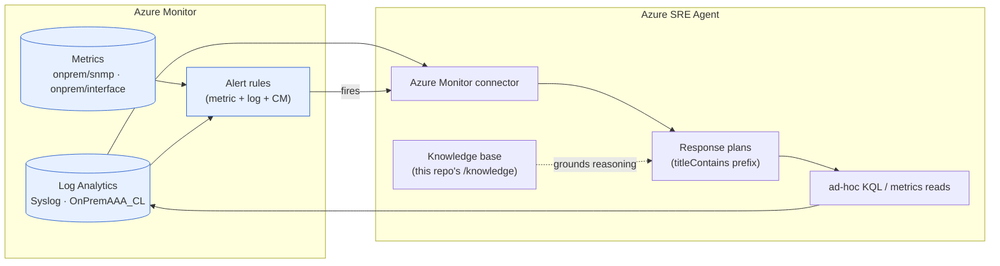
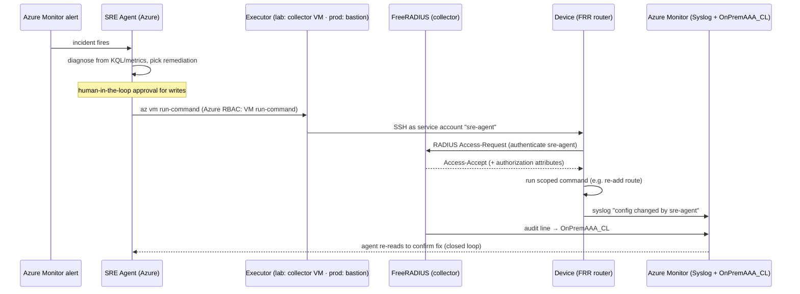
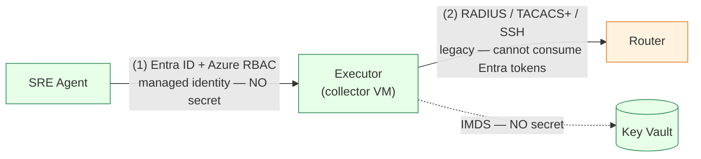

# How the SRE Agent Consumes On-Prem Telemetry & Closes the Loop

> **📍 Part B2 — Teaching the SRE Agent: knowledge, skills & closing the loop.** See the [docs hub](./README.md).

This document explains what the **Azure SRE Agent** does with the on-prem telemetry
once it lands in Azure Monitor: how it **reads** the signals to investigate an
incident (§1), and how it could **run remediation commands** back on the legacy
devices to close the loop (§2).

> Prerequisite reading: [`onprem-telemetry-pipelines-how-it-works.md`](./onprem-telemetry-pipelines-how-it-works.md)
> explains how syslog, SNMP metrics and RADIUS AAA reach Azure Monitor in the first
> place. This doc picks up where that one ends. For how the agent *resource* itself
> is configured (incident platform, knowledge base, detection model), see
> [`sre-agent-configuration.md`](./sre-agent-configuration.md).

---
## 1. How the SRE Agent *consumes* this telemetry

Everything above lands in two Azure Monitor stores. The **Azure SRE Agent** reads
from both — it never talks to the on-prem devices to *observe* them; it only ever
reads Azure Monitor. That indirection is the whole point: the collector +
AMA/Telegraf pipelines are what turn legacy, on-box protocols (syslog, SNMP,
RADIUS) into cloud-queryable signals the agent already knows how to use.

**Access model (read path):**

- **Identity & RBAC.** The agent's **managed identity** holds **Reader** (and
  effectively *Monitoring Reader*) on the lab resource group, which is what lets
  it query the workspace and read metrics. (It also holds **Network Contributor**
  for Azure-side remediation — see §2.)
- **Alerts are the trigger, not polling.** The agent does not poll dashboards. The
  `onprem-alerts.bicep` / connection-monitor alerts fire on a metric/log/CM
  threshold; the **Azure Monitor connector** delivers the alert to the agent,
  which opens an incident and selects a **response plan** by alert-name prefix
  (`<prefix>-cm-checks-failed`, `titleContains`).
- **Enrichment via KQL.** Once triggered, the agent runs **KQL against
  `netsre-law`** to pull the relevant `Syslog`, `OnPremAAA_CL`, and Connection
  Monitor rows around the incident window, and reads the SNMP **metrics** for the
  affected interfaces — correlating data-plane symptoms with control-plane events.
- **Grounding.** The `/knowledge` markdown and the custom agents/skills in
  `sre-agent-config/` tell it *what these tables mean* (e.g. that
  `OnPremAAA_CL.Result == "Failure"` spikes may indicate a misconfigured NAS or a
  brute-force attempt, that `ifInOctets` flatlining on the FRR uplink implies a
  dead data path).

**What the agent can already answer from telemetry alone:**

| Question | Signal it reads |
|----------|-----------------|
| "Is the on-prem router forwarding?" | SNMP `ifInOctets/ifOutOctets` trend + CM probe result |
| "Did someone change the device recently?" | `Syslog` (FRR/config) + `OnPremAAA_CL` login trail |
| "Who logged into the router before the outage?" | `OnPremAAA_CL` (`Operator`, `ClientHost`, `Result`, time) |
| "Is auth itself failing?" | `OnPremAAA_CL` `Result == "Failure"` rate |

> The read path is easy to validate directly: run the **same KQL/metrics queries** a
> response plan would — the queries in
> [§6 of the telemetry doc](./onprem-telemetry-pipelines-how-it-works.md#6-end-to-end-deploy--verify)
> are exactly what the agent would issue.

---

## 2. Closing the loop — how the SRE Agent *runs commands* on legacy devices

Reading telemetry is only half of SRE. To **remediate**, the agent must execute a
change *on the device*. For Azure-native faults it just uses its **Network
Contributor** identity (fix an NSG, repair a UDR, reset a VPN connection). But a
**legacy on-prem device has no Azure control plane** — you cannot `az` your way
into a router's config. The agent needs an **execution path with network
line-of-sight** to the device, and the device must **authenticate and authorize**
whoever shows up. That is where RADIUS **authentication (+ authorization)** — not
just the accounting/audit trail of [pipeline 3 (RADIUS AAA)](./onprem-telemetry-pipelines-how-it-works.md#3-pipeline-3--radius-aaa-audit--log-analytics) — becomes necessary.

> **What is the "executor"?** *Executor* is this document's term (**not** an Azure
> product concept) for **the compute inside the on-prem network that performs the
> device-native login/command on the agent's behalf.** The SRE Agent does **not**
> SSH into the router itself: it is a **cloud-managed service with no route** into
> the private RFC1918 LAN, and its action surface is **Azure control-plane
> operations** (ARM calls + connectors, gated by RBAC and approval), *not* a
> general SSH client holding device credentials. So it triggers an Azure action it
> *is* allowed to make (e.g. `az vm run-command`), which lands execution on the
> in-network executor, and **that box** does the SSH → PAM → RADIUS login. Who
> plays "executor" differs by environment (see the split below).

**Keep two contexts separate — this section is split accordingly.** What is fine
for the lab (basic authN/authZ on a container/VM box) is *not* what you would run
against real hardware under stringent security requirements:

| Concern | 🧪 Lab (this repo) | 🏭 Production (hardware, stringent security) |
|---------|--------------------|----------------------------------------------|
| Device | FRR on a Linux VM / Containerlab | vendor NOS (Cisco / Juniper / Nokia / Arista) |
| **Executor** | the **collector VM** (reuses the monitoring box) | a **dedicated hardened bastion / PAM jump server** — *never* the monitoring box (separation of duties) |
| Agent → executor | `az vm run-command` | Automation Hybrid Worker / Function / privileged-access workflow, with approval |
| AuthN | `pam_radius` → FreeRADIUS (single box) | RADIUS/TACACS+ to a **hardened, HA AAA cluster** |
| AuthZ | coarse (login = shell) | **TACACS+ per-command** authorization |
| Accounting | FreeRADIUS auth log → `OnPremAAA_CL` | RADIUS Accounting (1813) + TACACS+ command accounting → **SIEM** |
| Secrets | script-default shared secret; static `netops-oper` | Key Vault / HSM; **JIT short-lived** creds; **RadSec** certs (§2.4) |
| Approval | optional (demo the gate) | **mandatory human-in-the-loop** for every write |

The subsections below give the **lab wiring first**, then the **production
hardening** for each concern.

### 2.1 AAA, precisely — and what we have vs. what actuation needs

| AAA leg | Question | Protocol packet | Implemented today? | Needed for actuation? |
|---------|----------|-----------------|--------------------|-----------------------|
| **Authentication** | "Are you who you say?" | RADIUS Access-Request/Accept | ✅ yes — `pam_radius` on the FRR router authenticates logins against FreeRADIUS | ✅ the agent's executor must authenticate the same way |
| **Authorization** | "Are you allowed to run *this*?" | RADIUS VSAs / privilege-level, or **TACACS+** per-command | ⚠️ coarse only (login = full shell) | ✅ needed to scope the agent to safe commands |
| **Accounting** | "What did you do?" | RADIUS Accounting (1813) / audit log | ✅ audit trail via FreeRADIUS auth log → `OnPremAAA_CL` | ✅ every agent action must be recorded |

So the [RADIUS AAA pipeline](./onprem-telemetry-pipelines-how-it-works.md#3-pipeline-3--radius-aaa-audit--log-analytics) gave us **authentication + an audit trail**. Actuation additionally needs a
**dedicated machine identity** for the agent and **command authorization**.

### 2.2 The execution path — an in-VNet executor (jump host)

The SRE Agent runs in Azure and has no direct route into the on-prem LAN, so it
invokes an **executor that already lives in the on-prem VNet**. **In the lab** the
**collector VM is the natural choice** (it has line-of-sight to every device and
already holds the AAA relationship). **In production, use a dedicated hardened
bastion / PAM jump server instead — never the monitoring collector** — so that
privileged device access is isolated from telemetry collection (separation of
duties). Either way the agent reaches the executor via an **Azure control-plane
action** it *is* allowed to make (`az vm run-command` in the lab; an Automation
runbook / Function on a Hybrid Worker in production), and the executor performs the
device-native change (SSH / NETCONF / gNMI / vendor API).

Why this shape:

- **No inbound to Azure, no new exposure.** The device never needs a public
  endpoint; the executor initiates outbound-style SSH from inside the VNet.
- **Azure RBAC gates the trigger.** Granting the agent identity **only** the
  `Microsoft.Compute/virtualMachines/runCommand/action` (a tightly-scoped custom
  role on the executor VM) means the agent can *ask the executor to act* but cannot
  freely reconfigure Azure.
- **RADIUS gates the device.** Even with run-command, the executor still has to
  **authenticate to the device as a real RADIUS principal** — so the device (not
  Azure) remains the authority on who may log in, and every action is attributed
  to `sre-agent`, not to a shared root.
- **The loop closes in telemetry.** The change emits syslog + a RADIUS audit line,
  which flow back through the [syslog and RADIUS pipelines](./onprem-telemetry-pipelines-how-it-works.md#0-the-big-picture), so the agent can **verify its own remediation**
  and the audit trail shows an autonomous actor did it.

### 2.3 Implementing actuation — lab path vs. production hardening

None of this is deployed yet. Each step lists the **🧪 lab** implementation (the
minimum to prove the path on FRR) and the **🏭 production** hardening for real
hardware under stringent security requirements.

1. **Agent service account.**
   - 🧪 *Lab:* add an `sre-agent` principal to FreeRADIUS
     (`mods-config/files/authorize`), distinct from the human `netops-oper` so its
     actions are attributable and independently revocable. Enable **RADIUS
     Accounting** (port **1813**, `Acct-Start/Stop`) alongside the auth log for a
     formal session record.
   - 🏭 *Prod:* the account lives in a **hardened, HA AAA cluster**; its credential
     is **JIT / short-lived from Key Vault or an HSM** (see §2.4), never a static
     password; accounting streams to a **SIEM**, not only Log Analytics.

2. **Authorization scoping.**
   - 🧪 *Lab:* RADIUS gives only coarse authorization, so constrain `sre-agent` with
     a **restricted shell** (`rbash` / forced-command / `sudo` allow-list) on the
     device — login still equals "a shell", but only a fixed command set runs.
   - 🏭 *Prod:* use **TACACS+** (modelled with `tac_plus` in the lab) for true
     **per-command authorization + command accounting** — the industry norm for
     Cisco / Juniper / Nokia. RADIUS authenticates; TACACS+ answers "may
     `sre-agent` run *this exact command*?".

3. **Execution trigger & blast radius.**
   - 🧪 *Lab:* a custom Azure role on the collector VM granting the agent identity
     *only* `Microsoft.Compute/virtualMachines/runCommand/action`, plus a hardened
     remediation script that SSHes as `sre-agent` and accepts only a **whitelisted
     set of parameterized fixes**.
   - 🏭 *Prod:* a **dedicated bastion / PAM jump server** (not the monitoring
     collector), reached via an **Automation Hybrid Worker / Function**; the
     allow-listed fixes are versioned, code-reviewed, and signed.

4. **Human-in-the-loop.**
   - 🧪 *Lab:* optional — useful to demonstrate the gated-action flow.
   - 🏭 *Prod:* **mandatory approval** on any state-mutating command; observation and
     diagnosis stay autonomous. The SRE Agent supports gated actions in response
     plans.

> **When to graduate to a vendor NOS.** FRR authenticates via Linux PAM, so it
> proves the *authentication + execution* path faithfully, but it has no native
> concept of privilege levels or per-command TACACS+ authorization. To exercise
> **real command authorization/accounting** (`aaa authorization commands`,
> `aaa accounting commands`), swap the FRR box for a vendor NOS (Nokia SR Linux,
> Arista cEOS, Cisco) in the Containerlab fabric — the RADIUS/TACACS+ server and
> the executor pattern stay exactly the same.

### 2.4 Identity & credential model — managed identity / WIF vs. long-lived secrets

A natural question: can the `sre-agent` service account use **Azure managed
identity + Workload Identity Federation (WIF)** instead of long-lived secrets? The
answer hinges on recognising **two distinct authentication boundaries** — managed
identity/WIF cleanly solves one but **cannot natively cross the other**.

**Boundary 1 — Agent → Executor (Azure control plane): secretless.**
`az vm run-command` is authenticated by Entra + Azure RBAC; the executor reads any
secrets it needs from **Key Vault using its own managed identity via IMDS**. No
stored secret on either leg.

**Boundary 2 — Executor → device (device plane): cannot use Entra tokens.**
RADIUS (RFC 2865) and TACACS+ predate OAuth/OIDC. There is **no standard way for a
device to accept an Entra JWT as a credential** (no "EAP-OAuth", no token
introspection). So you cannot federate a managed identity *directly* into a
router login.

**Where WIF actually fits:**
- **Executor in Azure (our collector VM):** WIF adds nothing — the VM already has a
  native managed identity via IMDS. Use it directly.
- **Executor on *real* on-prem hardware (no Azure MI):** *this* is WIF's use case —
  federate an on-prem OIDC IdP / k8s SA → Entra so the off-Azure box gets Entra
  tokens **without a stored client secret**. But that token still only helps it
  reach *Azure* (e.g. Key Vault) — it still can't be handed to the router as a
  RADIUS credential.

**What's irreducible vs. what can be ephemeral:**

| Secret | Non-long-lived? |
|--------|-----------------|
| Agent → executor (Azure) | ✅ Managed identity, no secret |
| Executor → Key Vault | ✅ Managed identity, no secret |
| **`sre-agent` user credential** (presented at device login) | ✅ **JIT / short-lived** (below) |
| **NAS ↔ RADIUS-server shared secret** | ⚠️ Long-lived by protocol — rotate, or replace with **RadSec (RADIUS/TLS)** certs |

**The user credential does not have to be a static password.** Preferred pattern:
1. Executor uses its **managed identity** to fetch a **just-in-time, short-lived
   credential** from Key Vault (or mint an OTP), scoped to one remediation session.
2. It presents that as the RADIUS "password" over the SSH keyboard-interactive →
   PAM → RADIUS chain.
3. FreeRADIUS validates it — via **`rlm_rest`** calling a Key Vault / REST backend
   in its `authenticate` section, or as a pre-provisioned OTP.

This shrinks the long-lived surface to **(a)** Key Vault access — itself governed
by the secretless managed identity — and **(b)** the NAS↔server trust anchor.

**The one thing you can't eliminate with legacy gear** is the **device↔AAA-server
trust**. TACACS+ is *worse* here (its entire body is obfuscated with an MD5 scheme
keyed on the shared secret). Two realistic options:
- **Rotate** a Key Vault-sourced shared secret (simple; sufficient for the lab).
- **RadSec (RADIUS over TLS, RFC 6614)** — replaces the shared secret with
  **mutual-TLS certificates** that can be short-lived and PKI-managed/revocable.
  Modern NOSes (Nokia SR Linux, Arista, newer Cisco) support it; FRR-via-PAM does
  not.

**Bottom line:** a *fully* secretless design is **not achievable with legacy
devices**, because device firmware only speaks RADIUS/TACACS+/SSH and can't
validate Entra tokens. The best achievable posture is: **managed identity for both
Azure legs** (secretless) + a **JIT short-lived user credential** from Key Vault
(not a static password) + the **NAS trust anchor hardened via rotation or RadSec
certificates**. WIF is relevant *only* if the executor/RADIUS server runs off-Azure.

---

*Companion docs:*
[Telemetry pipelines — how it works](./onprem-telemetry-pipelines-how-it-works.md)
· [SRE Agent configuration — how it works](./sre-agent-configuration.md)
· [On-prem simulation & telemetry (design/decisions)](./onprem-network-simulation-and-telemetry.md)
· [Containerlab on-prem — how it works](./containerlab-onprem-how-it-works.md)
